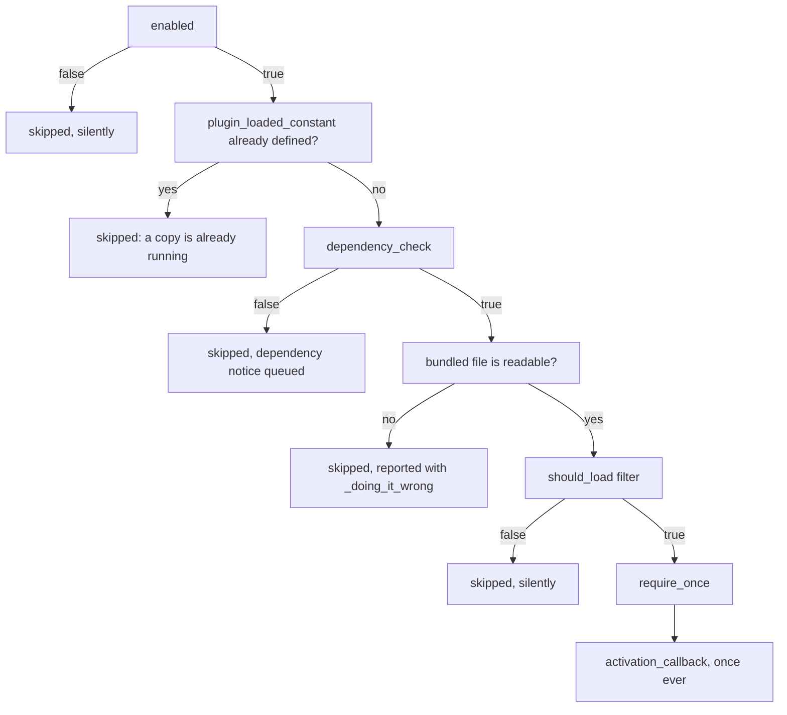

# Configuration

## Setting up

```php
use Nexcess\PluginAbsorber\Config;

Config::set_hook_prefix( 'give' );          // required — keys hooks and options
Config::set_container( give()->container ); // required — everything is resolved from it
```

The hook prefix accepts letters, numbers, hyphens, and underscores. Anything else throws
`Config_Exception`, as does reading the prefix before it is set. Hook names repeat it verbatim;
option names lowercase it and turn hyphens into underscores, so `Give-Core` hooks
`Give-Core/plugin_absorber/should_load` and stores `give_core_plugin_absorber_notices`.

Any implementation of StellarWP's `ContainerInterface` will do — the one your plugin already
hands to Telemetry, Uplink or Harbor. It is required: `Config::get_container()` throws
`Config_Exception` when none is set, and `Config::has_container()` is the probe. To replace one
of the library's own pieces, see [Extending](extending.md).

Both calls belong at `plugins_loaded` priority 0, in the block that owns your container rather
than in a service provider. Priority matters twice, for unrelated reasons:

- Conflict resolution runs at `plugins_loaded` priority 5 and the load at 6, and WordPress
  ignores a callback added at or past the priority it is already dispatching. Boot after that
  and the whole sequence runs inline, reported with `_doing_it_wrong()`.
- A host that builds its container lazily may *replace* it at priority 0. Hand this library the
  container before that happens and it holds an orphan whose bindings were discarded.

Only the second reason picks 0 out of 0 through 4; if your container is already built by then,
anywhere below 5 works. Order among the configuration calls does not matter, so long as they all
precede `Absorber::boot()`.

## Registering a sub-plugin

| Key | Type | Required | Meaning |
|---|---|:--:|---|
| `slug` | `string` | ✔ | Unique id — registry key, notice id, activation-tracking key. |
| `bundled_plugin_file` | `string` | ✔ | Absolute path to the **bundled** plugin's main file. This is what gets `require_once`d. |
| `plugin_loaded_constant` | `string` | ✔ | A constant the plugin defines when it loads. Both copies must define the *same* name, **at file scope**. **Load guard only** — see [Conflict handling](conflict-handling.md#the-load-guard). |
| `standalone_plugin_basename` | `string` | | The standalone's `dir/file.php` basename, used to detect and deactivate it. Omit when there is no standalone. **Detection only.** |
| `enabled` | `bool\|callable` | | `true` by default. A `callable( Sub_Plugin ): bool` is re-evaluated on every call, not cached. |
| `conflict_policy` | `string\|callable` | | `Conflict_Policy::DEACTIVATE` by default. See [Conflict handling](conflict-handling.md#policies). |
| `conflict_notice_message` | `callable` | | Used in all three places a conflict is reported — the merge notice, the still-active notice, and the rewritten activation-error screen. Each falls back to its own generic sentence naming the slug. |
| `dependency_notice_message` | `callable` | | Shown when `dependency_check` fails. Defaults to a generic, untranslated sentence naming the raw slug. |
| `activation_callback` | `callable( Sub_Plugin )` | | Runs **once, ever**, per slug, after a successful load. Make it idempotent. |
| `dependency_check` | `callable( Sub_Plugin ): bool` | | Skips the load and queues a notice when it returns false. |

Sub-plugins load in **registration order**, so register a dependency before anything that
extends it at include time, and register each slug exactly once. A config array the library
cannot use throws `Config_Exception` on the spot, in the call you can see in your own stack
trace; a duplicate slug is the exception that surfaces later, on `plugins_loaded`, since
registrations are buffered until the first read.

Register unconditionally and put anything you cannot decide up front — a licence, a setting the
site owner can change — in `enabled`, which is re-evaluated on every load. See
[Toggle a sub-plugin from a setting](recipes.md#toggle-a-sub-plugin-from-a-setting).

## How a sub-plugin loads

Each sub-plugin passes five gates, in order, and is skipped on the first failure:



Only the dependency gate says anything to the site owner — see [Notices](notices.md). An
unreadable `bundled_plugin_file` is a broken build in your plugin, so it is reported with
`_doing_it_wrong()` instead.

The guard constant is checked **before** the dependency check, so a plugin the admin can watch
working is never reported as missing its requirements. The
[`should_load` filter](filters.md#the-load-gate) sits last and can only veto: it cannot force a
load past a copy already in memory.

## Activation

A bundled plugin is `require_once`d, not activated, so `register_activation_hook()` never fires
for it. Whatever that hook would have done — create a table, seed options — goes in
`activation_callback` instead:

```php
'activation_callback' => static function ( Sub_Plugin $sub_plugin ) {
    \Give\Recurring\Install::create_tables();
},
```

It runs once ever per slug, is passed the `Sub_Plugin`, and only after a require that actually
happened — never for a sub-plugin whose load was skipped. The record lives in the
`{option_prefix}_plugin_absorber_activations` option, a network option on multisite, and is
written *after* the callback returns, so a callback that throws is reported with
`_doing_it_wrong()` and retried next request rather than marked done for good.

**Write it to be idempotent.** "Once, ever" is bookkeeping, not a lock: the record is read, the
callback runs, and the record is written, so two first requests arriving together can both pass
the check. A `dbDelta()` migration survives that; a blind `INSERT` of seed rows does not.

One record for the network is also one *run* for the network, in whichever site's request
reached the load pass first. Per-site work — a `$wpdb->prefix` table, a per-site option — is
yours to loop over: see [Do per-site work on multisite](recipes.md#do-per-site-work-on-multisite).

## What changes for the bundled plugin

WordPress includes plugins at global scope; this library includes them from inside a method, so
variables assigned at the top level of the bundled file are function-local, not globals:

```php
// In the bundled plugin's main file.
$my_plugin = new My_Plugin();             // Not a global. `global $my_plugin;` elsewhere sees null.
$GLOBALS['my_plugin'] = new My_Plugin();  // Works.
```

Everything else — function and class declarations, `define()`, hook registration, `__FILE__` —
is unaffected.

## Messages are callables, never strings

Your config array is built at plugin load — before `init`, and before your textdomain, so
calling `__()` there raises WordPress's `_load_textdomain_just_in_time` notice. The two message
keys therefore take something to call, and refuse a string outright:

```php
'conflict_notice_message' => static fn() => __( 'Recurring ships with Give now.', 'give' ),
'conflict_notice_message' => [ Give_Recurring::class, 'get_conflict_message' ],
'conflict_notice_message' => static fn() => give()->container->get( Conflict_Message::class ),
```

```php
// Config_Exception at registration: translated or not, a string here was produced too early.
'conflict_notice_message' => __( 'Recurring ships with Give now.', 'give' ),
```

Each callable is passed the `Sub_Plugin` and called on every read; a return that will not cast
to a string is treated as though nothing were configured.

**A plain function name is text, not a call.** `date`, `flush` and `key` are all real functions
and all plausible values, so wherever a string *is* accepted it is the value itself — which bars
`'Give_Recurring::get_conflict_message'` as much as `'give_recurring_conflict_message'`.

`conflict_policy` is the one key that takes either, since a policy is never text a user reads:

```php
'conflict_policy' => Conflict_Policy::DEFER,
'conflict_policy' => static fn( Sub_Plugin $sub_plugin ) => give_conflict_policy_for( $sub_plugin ),
```

`standalone_plugin_basename` takes a string only: it names a file already on disk.
`dependency_check` and `activation_callback` have nothing a string could collide with, so they
accept every callable form, a plain function name included.

Every typed key rejects a shape it cannot use at registration rather than at read time —
including a `[ class, method ]` pair naming a method that does not exist. `enabled` is the
exception: it is read as a boolean if it is not callable, so an array or an object there passes
registration and evaluates as enabled. Give it a `bool` or a `callable`, and nothing else. The
[filters](filters.md) are the other way in, and run last, after the configured value.

## Complete example

```php
use Nexcess\PluginAbsorber\Config;
use Nexcess\PluginAbsorber\Conflict_Policy;
use Nexcess\PluginAbsorber\Absorber;
use Nexcess\PluginAbsorber\Sub_Plugin;

add_action( 'plugins_loaded', function () {
    Config::set_hook_prefix( 'give' );
    Config::set_container( give()->container );

    Absorber::register( [
        'slug'                       => 'give-recurring',
        'bundled_plugin_file'        => GIVE_PLUGIN_DIR . 'sub-plugins/give-recurring/give-recurring.php',
        'plugin_loaded_constant'     => 'GIVE_RECURRING_VERSION',
        'standalone_plugin_basename' => 'give-recurring/give-recurring.php',
        'enabled'                    => static fn( Sub_Plugin $sub_plugin ) => give_addon_is_licensed( $sub_plugin->get_slug() ),
        'conflict_policy'            => Conflict_Policy::DEACTIVATE,
        'conflict_notice_message'    => static fn() => __( 'Recurring Donations ships with Give now.', 'give' ),
        'activation_callback'        => static function ( Sub_Plugin $sub_plugin ) {
            \Give\Recurring\Install::create_tables();
        },
    ] );

    Absorber::register( [
        'slug'                       => 'give-stripe',
        'bundled_plugin_file'        => GIVE_PLUGIN_DIR . 'sub-plugins/give-stripe/give-stripe.php',
        'plugin_loaded_constant'     => 'GIVE_STRIPE_VERSION',
        'standalone_plugin_basename' => 'give-stripe/give-stripe.php',
        // The standalone is still ahead of the bundled copy, so let it win for now.
        'conflict_policy'            => Conflict_Policy::DEFER,
        'dependency_check'           => static fn() => function_exists( 'curl_init' ),
        'dependency_notice_message'  => static fn() => __( 'Stripe payments need the cURL extension.', 'give' ),
    ] );

    Absorber::boot();
}, 0 );
```
