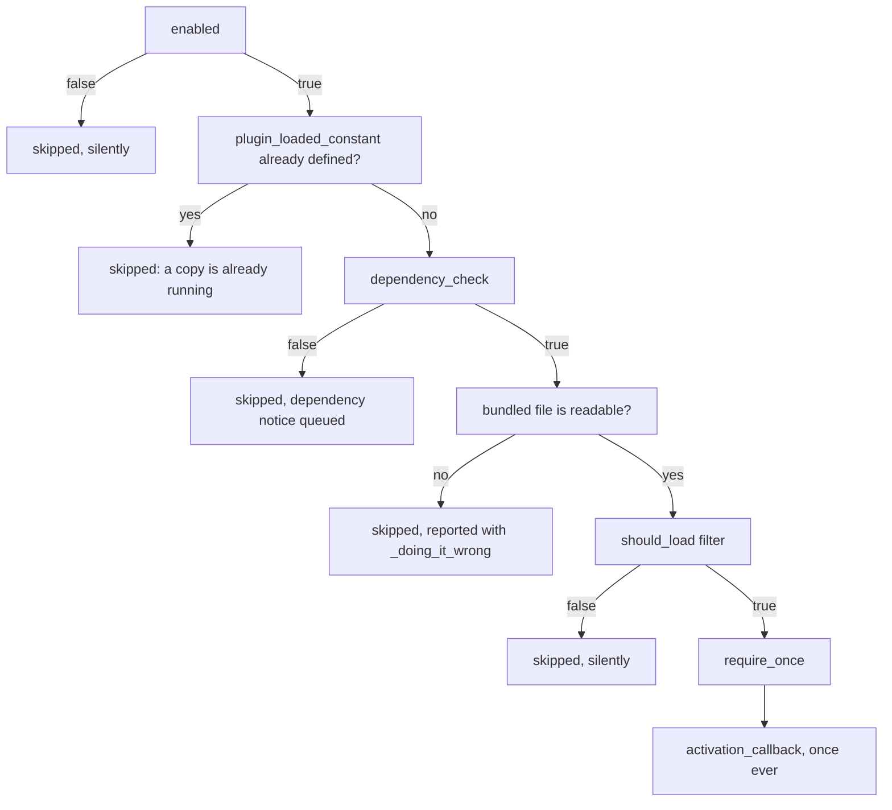

# Configuration

## Setting up

```php
use Nexcess\PluginAbsorber\Config;

Config::set_hook_prefix( 'give' );          // required — keys hooks and options
Config::set_container( give()->container ); // required — everything is resolved from it
```

The hook prefix accepts letters, numbers, hyphens, and underscores; anything else throws
`Config_Exception`, as does reading it before it is set. Hook names repeat it verbatim; option
names lowercase it and fold hyphens to underscores.

Any implementation of StellarWP's `ContainerInterface` will do. `Config::get_container()` throws
`Config_Exception` when none is set; `Config::has_container()` is the probe. To replace one of the
library's own pieces, see [Extending](extending.md).

`Config::set_host_plugin_basename( plugin_basename( __FILE__ ) )` is optional and matters only on
multisite: it stops the library deactivating a network-active standalone when your plugin is not
itself network-activated, stranding the network's other sites. Left unset, nothing changes.

Both calls belong at `plugins_loaded` priority 0, in the block that owns your container rather than
in a service provider, since a host that builds its container lazily may replace it at priority 0.
Anything below 5 works for a container already built — conflict resolution runs at
`plugins_loaded` priority 5 and the load at 6, and booting at 5 or later runs the whole sequence
inline, reported with `_doing_it_wrong()`. `Absorber::boot()` is idempotent but keeps the container
its first call saw.

## Registering a sub-plugin

| Key | Type | Required | Meaning |
|---|---|:--:|---|
| `slug` | `string` | ✔ | Unique id — registry key, notice id, activation-tracking key. |
| `bundled_plugin_file` | `string` | ✔ | Absolute path to the **bundled** plugin's main file — what gets `require_once`d. |
| `plugin_loaded_constant` | `string` | ✔ | A constant the plugin defines **at file scope** when it loads; both copies normally define the *same* name. **Load guard only** — see [Conflict handling](conflict-handling.md#the-load-guard). |
| `standalone_plugin_basename` | `string` | | The standalone's `dir/file.php` basename, used to detect and deactivate it; omit when there is none. **Detection only.** |
| `enabled` | `bool\|callable` | | `true` by default. A `callable( Sub_Plugin ): bool` is re-evaluated on every call, not cached. |
| `conflict_policy` | `string\|callable` | | `Conflict_Policy::DEACTIVATE` by default. See [Conflict handling](conflict-handling.md#policies). |
| `conflict_notice_message` | `callable` | | Words all three conflict reports: the merge notice, the still-active notice, and the rewritten activation-error screen. Each falls back to a generic sentence naming the slug. |
| `dependency_notice_message` | `callable` | | Shown when `dependency_check` fails. Defaults to a generic, untranslated sentence naming the raw slug. |
| `activation_callback` | `callable( Sub_Plugin )` | | Runs **once, ever**, per slug, after a successful load. Make it idempotent. |
| `dependency_check` | `callable( Sub_Plugin ): bool` | | Skips the load and queues a notice when it returns false. |

Sub-plugins load in **registration order**, so register a dependency before anything that extends
it at include time, and register each slug exactly once. An unusable config array throws
`Config_Exception` from `Absorber::register()`; a duplicate slug is caught later, at the first read
of the registry on `plugins_loaded`, where the second registration is discarded and reported through
`_doing_it_wrong()`.

Register unconditionally: anything you cannot decide up front belongs in `enabled`. See
[Toggle a sub-plugin from a setting](recipes.md#toggle-a-sub-plugin-from-a-setting).

## How a sub-plugin loads

Each sub-plugin passes five gates, in order, and is skipped on the first failure:



Only the dependency gate says anything to the site owner — see [Notices](notices.md). The guard
constant is deliberately checked before the dependency check, and the
[`should_load` filter](filters.md#the-load-gate) can only veto.

## Activation

A bundled plugin is `require_once`d, not activated, so `register_activation_hook()` never fires for
it. Whatever that hook would have done goes in `activation_callback` instead:

```php
'activation_callback' => static function ( Sub_Plugin $sub_plugin ) {
    \Give\Recurring\Install::create_tables();
},
```

**The wrapper is load-bearing.** `activation_callback` is `is_callable()`-checked at registration,
before the bundled plugin is loaded, so `[ Install::class, 'create_tables' ]` throws
`Config_Exception` on a class that does not exist yet. A closure names it only when the load pass
calls it.

It runs only after a require that actually happened. The record lives in the
`{option_prefix}_plugin_absorber_activations` option — a network option on multisite — and is
written *after* the callback returns, so one that throws is reported with `_doing_it_wrong()` and
retried next request.

**Write it to be idempotent.** "Once, ever" is bookkeeping, not a lock: two first requests arriving
together can both run the callback. A `dbDelta()` migration survives that; a blind `INSERT` of seed
rows does not.

One record for the network is one *run* for the network, in whichever site's request reached the
load pass first; a site created afterwards never gets it. Per-site work is yours to loop over, and
a later site yours to catch on `wp_initialize_site`: see
[Do per-site work on multisite](recipes.md#do-per-site-work-on-multisite).

## Bringing the standalone's git history with it

Copying the standalone's files into your repository loses its git history. The commit messages, the
blame, and with them the reason any given line is written the way it is, all stay behind in the old
repository — so a developer or an agent working on the bundled copy later has nothing to go on, and
`git blame` answers every question with the single commit that copied the files in.

A submodule would keep that history, but it is the wrong shape here: a bundled copy usually needs
small host-only edits that have no business in the standalone's repository, which is normally
archived soon afterwards anyway.

Merge the standalone in as an unrelated history instead, nesting its whole tree under the sub-plugin
directory first so that the two share no path and the merge has nothing to conflict over:

```bash
# On a branch of the host plugin's repo.
git switch -c absorb-give-recurring

# Pull the standalone's commits in as a second, unrelated history.
git remote add old-repo git@github.com:givewp/give-recurring.git
git fetch --no-tags old-repo

# Nest every top-level entry it tracks, in a scratch worktree so that this checkout
# is never switched away from.
git worktree add -b old-repo-import ../absorb-worktree old-repo/main
cd ../absorb-worktree
mkdir __absorb-import
git ls-tree --name-only -z HEAD | xargs -0 -I{} git mv {} __absorb-import/
mkdir -p sub-plugins
git mv __absorb-import sub-plugins/give-recurring
git commit -m "Move Give Recurring under sub-plugins/give-recurring"
cd -

# Nothing overlaps now, so this merge has nothing to conflict over.
git merge --allow-unrelated-histories old-repo-import

# The history is part of your branch now; the rest can be deleted.
git worktree remove ../absorb-worktree
git remote remove old-repo
git branch -d old-repo-import
```

**Move everything, so the merge only ever touches the sub-plugin directory.** The standalone's
`README.md`, `LICENSE` and `.gitignore` sit at *its* top level: leave them there and they merge into
*your* repository root, conflicting with the files of the same name and adding the ones with no
counterpart. `git ls-tree` moves whatever the standalone tracks, which a hand-written list of paths
will not.

**The staging directory keeps the destination out of the tree being moved.** That move runs against
the standalone's own checkout, so a destination like `includes/notifications` lands under an
`includes/` the standalone tracks itself, and git will not move a directory into itself. Only that
one entry fails while every other one succeeds, so the error scrolls past in a screen of moves that
worked. Setting the whole tree aside under a name nothing uses, then renaming it into place once,
does not care where the destination sits.

**The scratch worktree is what stops this deleting your build output.** Checking the standalone's
tree out over your own means git writing a tree that knows nothing about your repository, and git
does not protect ignored files: one that collides is overwritten in place, and switching back then
removes any directory left holding nothing but ignored files. A `dist/` or `assets/` the standalone
also tracks takes your untracked build artifacts with it, silently, and a `.gitignore`d database dump
under one goes the same way. A worktree is a second checkout of the same repository in another
directory, so the branch work happens there and yours is only ever merged into.

**`--no-tags`.** A plain fetch also takes any tag reachable from what it downloads. The standalone's
`1.1.0` then sits among your own releases, while a `1.0.0` you already have silently does not import
at all, since git will not move an existing tag.

**The move commit moves and nothing else.** `git mv` alone leaves every blob identical, so rename
detection ties each file to its past. Rewrite a file in that same commit and it drops below the
similarity threshold, taking its history with it — blame stops at the move. Host-only edits belong in
commits after the merge.

**Merge the PR with a merge commit.** Squash flattens the imported commits into one and rebase
replays them onto your trunk; either discards what this was for.

Afterwards `git blame` and `git log --follow` cross the move with no extra flags, attributing each
line to the author who wrote it in the standalone. Path-filtered
`git log -- sub-plugins/give-recurring` is the exception and stops at the move, since that is where
the directory begins.

Where the files were copied in by hand already, that merge conflicts `add/add` on every shared file
and `-X ours` resolves toward what you have, leaving the tree byte-identical and blame intact. It
only settles files present on both sides, so read `git show --stat HEAD` for anything the standalone
tracked and you never copied.

## What changes for the bundled plugin

This library includes bundled plugins from inside a method, not at global scope, so variables
assigned at the top level of the bundled file are function-local, not globals:

```php
// In the bundled plugin's main file.
$my_plugin = new My_Plugin();             // Not a global. `global $my_plugin;` elsewhere sees null.
$GLOBALS['my_plugin'] = new My_Plugin();  // Works.
```

Everything else — function and class declarations, `define()`, hook registration, `__FILE__` —
is unaffected.

## Messages are callables, never strings

Your config array is built before `init` and before your textdomain, so `__()` there raises
WordPress's `_load_textdomain_just_in_time` notice. The two message keys therefore take something
to call, and refuse a string outright:

```php
'conflict_notice_message' => static fn() => __( 'Recurring ships with Give now.', 'give' ),
'conflict_notice_message' => [ Give_Recurring::class, 'get_conflict_message' ],
'conflict_notice_message' => static fn() => give()->container->get( Conflict_Message::class ),
```

```php
// Config_Exception at registration: translated or not, a string here was produced too early.
'conflict_notice_message' => __( 'Recurring ships with Give now.', 'give' ),
```

Each callable is passed the `Sub_Plugin` and called on every read; a return that will not cast to a
string is treated as though nothing were configured. Wherever a string *is* accepted it is the
value itself and never a function name to call.

`conflict_policy` takes either, since a policy is never text a user reads:

```php
'conflict_policy' => Conflict_Policy::DEFER,
'conflict_policy' => static fn( Sub_Plugin $sub_plugin ) => give_conflict_policy_for( $sub_plugin ),
```

`standalone_plugin_basename` takes a string only. `dependency_check` and `activation_callback`
accept every callable form, a plain function name included.

Every typed key rejects a shape it cannot use at registration rather than at read time, including a
`[ class, method ]` pair whose method does not exist. `enabled` is the exception: not callable means
it is read as a boolean, so an array or an object there evaluates as enabled — give it a `bool` or
a `callable`. The [filters](filters.md) are the other way in, and run last.

## Complete example

```php
use Nexcess\PluginAbsorber\Config;
use Nexcess\PluginAbsorber\Conflict_Policy;
use Nexcess\PluginAbsorber\Absorber;
use Nexcess\PluginAbsorber\Sub_Plugin;

add_action( 'plugins_loaded', function () {
    Config::set_hook_prefix( 'give' );
    Config::set_container( give()->container );

    Absorber::register( [
        'slug'                       => 'give-recurring',
        'bundled_plugin_file'        => GIVE_PLUGIN_DIR . 'sub-plugins/give-recurring/give-recurring.php',
        'plugin_loaded_constant'     => 'GIVE_RECURRING_VERSION',
        'standalone_plugin_basename' => 'give-recurring/give-recurring.php',
        'enabled'                    => static fn( Sub_Plugin $sub_plugin ) => give_addon_is_licensed( $sub_plugin->get_slug() ),
        'conflict_policy'            => Conflict_Policy::DEACTIVATE,
        'conflict_notice_message'    => static fn() => __( 'Recurring Donations ships with Give now.', 'give' ),
        'activation_callback'        => static function ( Sub_Plugin $sub_plugin ) {
            \Give\Recurring\Install::create_tables();
        },
    ] );

    Absorber::register( [
        'slug'                       => 'give-stripe',
        'bundled_plugin_file'        => GIVE_PLUGIN_DIR . 'sub-plugins/give-stripe/give-stripe.php',
        'plugin_loaded_constant'     => 'GIVE_STRIPE_VERSION',
        'standalone_plugin_basename' => 'give-stripe/give-stripe.php',
        // Not taking this one over yet: ship the bundled copy, but leave any standalone running.
        'conflict_policy'            => Conflict_Policy::DEFER,
        'dependency_check'           => static fn() => function_exists( 'curl_init' ),
        'dependency_notice_message'  => static fn() => __( 'Stripe payments need the cURL extension.', 'give' ),
    ] );

    Absorber::boot();
}, 0 );
```
