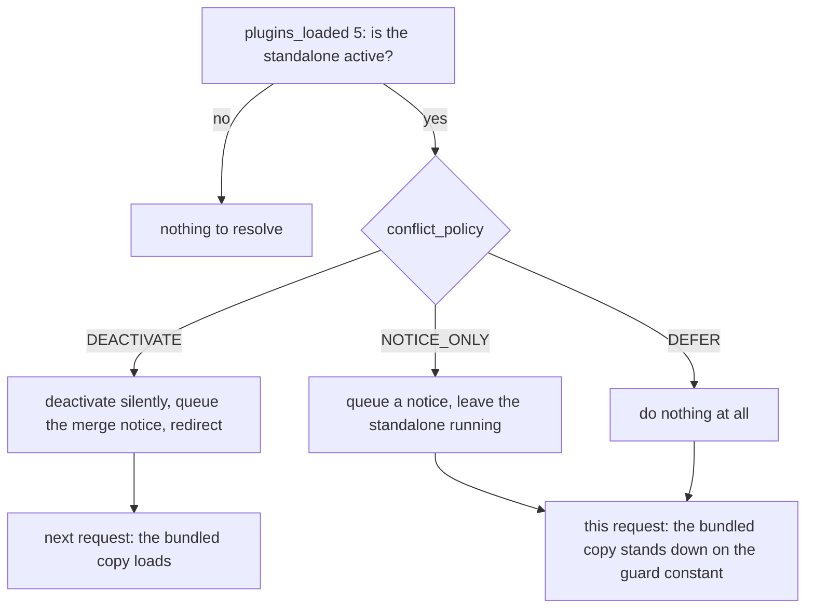
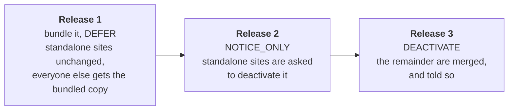

<!-- cSpell:ignore LDRP -->

# Recipes

The shapes hosts actually write. [Configuration](configuration.md) is the key-by-key reference
behind them.

## Toggle a sub-plugin from a setting

Register unconditionally and put the condition in `enabled`, re-read on every request, so the
settings screen saves an option and does nothing else:

```php
Absorber::register( [
    'slug'                       => 'give-recurring',
    'bundled_plugin_file'        => GIVE_PLUGIN_DIR . 'sub-plugins/give-recurring/give-recurring.php',
    'plugin_loaded_constant'     => 'GIVE_RECURRING_VERSION',
    'standalone_plugin_basename' => 'give-recurring/give-recurring.php',
    'enabled'                    => static fn() => (bool) get_option( 'give_recurring_enabled', true ),
] );
```

`enabled` is the first gate in [how a sub-plugin loads](configuration.md#how-a-sub-plugin-loads),
and gates conflict resolution too: off leaves the standalone alone as well.

**Switching the toggle off unloads nothing**: the next request is the one that skips the
`require_once`, so anything that has to stop sooner the sub-plugin gates itself.

**Keep the callable cheap** — it runs on both the conflict pass and the load pass: an option read
is fine, a remote licence check is not.

## Register several add-ons from one manifest

The manifest carries what differs between entries; the loop supplies the keys they share. Its order
is load order.

```php
$sub_plugins = [
    'give-recurring' => 'GIVE_RECURRING_VERSION',
    'give-stripe'    => 'GIVE_STRIPE_VERSION',
];

foreach ( $sub_plugins as $slug => $constant ) {
    Absorber::register( [
        'slug'                       => $slug,
        'bundled_plugin_file'        => GIVE_PLUGIN_DIR . "sub-plugins/{$slug}/{$slug}.php",
        'plugin_loaded_constant'     => $constant,
        'standalone_plugin_basename' => "{$slug}/{$slug}.php",
        'enabled'                    => static fn() => give_addon_is_enabled( $slug ),
    ] );
}
```

An unusable entry throws `Config_Exception` from its own `Absorber::register()` call, so the stack
trace points at your loop; a duplicate `slug` is caught at the first read, on `plugins_loaded`, where
the second registration is discarded and reported through `_doing_it_wrong()`.

## Choose a policy, and know what the site owner sees

What each branch leaves the site owner with:



| Policy | The standalone | This request | Afterwards |
|---|---|---|---|
| `DEACTIVATE` | turned off silently, network-wide | still in memory, so the bundled copy stands down; the user is redirected to the screen they asked for | the bundled copy loads; a merge notice explains the swap |
| `NOTICE_ONLY` | left running | the bundled copy stands down | unchanged until someone acts on the notice |
| `DEFER` | left running | the bundled copy stands down | unchanged, and nothing is said |

Only an interactive admin `GET` with no `action` reaches any of this —
[conflict handling](conflict-handling.md#when-resolution-runs) has the rest of the gates.

## Ship the absorption over several releases

Bundling the code and taking over from the standalone need not be the same release. Moving the
`conflict_policy` one step per release warns a site before anything of theirs is turned off:



Only release 3 touches a site's active plugins. Each step is a one-constant change — or none, if
the policy reads a value you can move without shipping:

```php
/**
 * Read fresh on every conflict pass, so a settings screen, WP-CLI or a migration can move the
 * stage with no release.
 */
'conflict_policy' => static fn() => get_option( 'give_absorption_stage', Conflict_Policy::DEFER ),
```

An unrecognised value is treated as `NOTICE_ONLY`, never as consent to deactivate, so a stale or
misspelt option cannot turn a plugin off.

## Defer to a standalone that is a new codebase

An edge case that has happened: `learndash-propanel/learndash_propanel.php` was ProPanel 2.x, which
LearnDash absorbed into its Reports module, and ProPanel 3.0 later arrived at that same path as an
unrelated codebase with its own namespace and its own `LDRP_*` constants.
`standalone_plugin_basename` cannot tell the two apart; the installed version can, so read it and
defer:

```php
add_filter( 'learndash/plugin_absorber/conflict_policy', static function ( $policy, $sub_plugin ) {
    if ( $sub_plugin->get_slug() !== 'propanel' ) {
        return $policy;
    }

    if ( ! function_exists( 'get_plugin_data' ) ) {
        include_once ABSPATH . 'wp-admin/includes/plugin.php';
    }

    $installed = get_plugin_data(
        WP_PLUGIN_DIR . '/' . $sub_plugin->get_standalone_plugin_basename(),
        false,
        false
    );

    // 3.0 and up at this path is the newer codebase, not an older copy of ours.
    return version_compare( $installed['Version'], '3.0.0-dev', '>=' )
        ? Conflict_Policy::DEFER
        : $policy;
}, 10, 2 );
```

**`DEFER` here does not stand the bundled copy down.** The policy only leaves the standalone alone;
[the load guard](conflict-handling.md#the-load-guard) decides the rest, one priority later:

| The standalone at that basename | The guard constant | The bundled copy, under `DEFER` |
|---|---|---|
| an older version of the same code | defined by it | stands down |
| a new codebase at the same path | never defined | **loads, alongside it** |

ProPanel 3.x defines only `LDRP_*`, never 2.x's `LD_PP_PLUGIN_DIR`, so the bundled Reports module
loads alongside it. Safe only because the two are not copies of each other: two copies loading at
once is the fatal this library exists to prevent.

## Do per-site work on multisite

The activation record is a network option, so `activation_callback` runs **once for the network**.
Per-site work loops:

```php
'activation_callback' => static function ( Sub_Plugin $sub_plugin ) {
    if ( ! is_multisite() ) {
        \Give\Recurring\Install::create_tables();

        return;
    }

    foreach ( get_sites( [ 'fields' => 'ids', 'number' => 0 ] ) as $site_id ) {
        switch_to_blog( $site_id );
        \Give\Recurring\Install::create_tables();
        restore_current_blog();
    }
},
```

That loop runs inside `plugins_loaded` on one unlucky request, so on a large network replace the
once-ever bookkeeping and record it per site instead — see [Extending](extending.md). Either way
write the callback to be idempotent; [activation](configuration.md#activation) has the retry and
concurrency detail.
