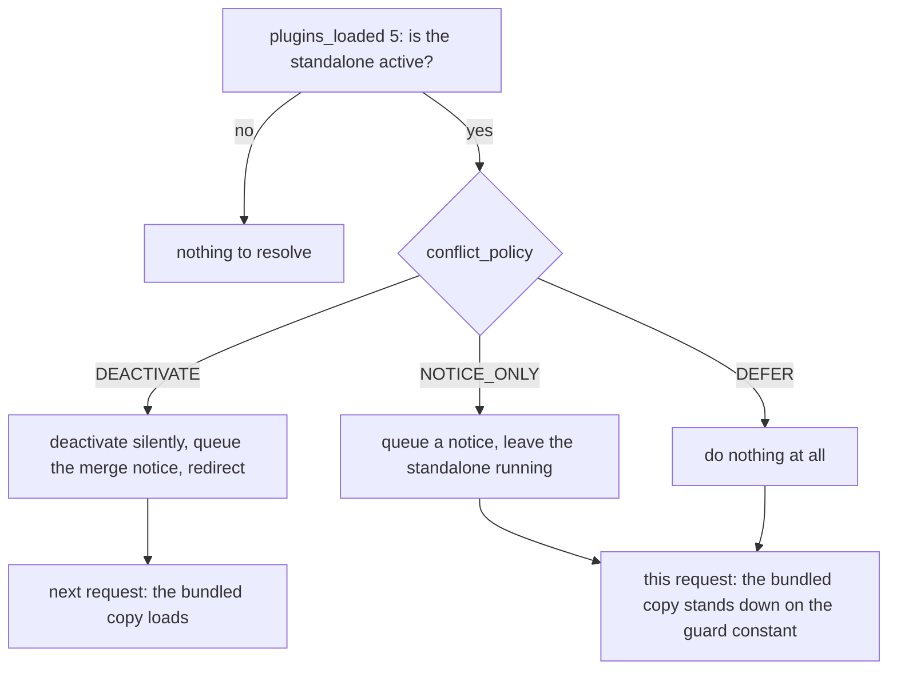
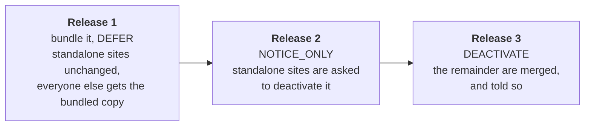

<!-- cSpell:ignore LDRP -->

# Recipes

The shapes hosts actually write. [Configuration](configuration.md) is the key-by-key reference
behind them.

## Toggle a sub-plugin from a setting

Register unconditionally and put the condition in `enabled`. It is re-read on every request rather
than resolved at registration, so the settings screen saves an option and does nothing else:

```php
Absorber::register( [
    'slug'                       => 'give-recurring',
    'bundled_plugin_file'        => GIVE_PLUGIN_DIR . 'sub-plugins/give-recurring/give-recurring.php',
    'plugin_loaded_constant'     => 'GIVE_RECURRING_VERSION',
    'standalone_plugin_basename' => 'give-recurring/give-recurring.php',
    'enabled'                    => static fn() => (bool) get_option( 'give_recurring_enabled', true ),
] );
```

`enabled` is the first gate, ahead of the guard constant —
[how a sub-plugin loads](configuration.md#how-a-sub-plugin-loads) has the rest of the chain. Three
things follow from where it sits.

**Switching the toggle off unloads nothing.** The `require_once` on this request already happened;
the next request is the one that skips it. Anything that has to stop immediately is the sub-plugin's
own business to gate.

**A disabled sub-plugin is invisible to conflict resolution too.** The toggle is checked first there
as well, so an off toggle also stops the standalone being deactivated: off means this library leaves
the plugin alone, standalone included.

**Keep the callable cheap.** It runs on the conflict pass and again on the load pass, so at least
twice on an admin page view. An option read is fine; a remote licence check belongs behind a value
you have already cached.

## Register several add-ons from one manifest

One `Absorber::register()` call per sub-plugin still happens here; the loop only builds each config
array on the way in. The manifest carries what differs between entries, the `+` union adds the keys
they share — so `bundled_plugin_file` is derived from each entry's own slug rather than written out
per entry — and the union never overwrites the left-hand side, so an entry that spells a shared key
out itself keeps its own value.

The loop is also where load order is decided: sub-plugins load in registration order, so anything
extended at include time has to be registered before its extender.

```php
$sub_plugins = [
    'give-recurring' => 'GIVE_RECURRING_VERSION',
    'give-stripe'    => 'GIVE_STRIPE_VERSION',
];

foreach ( $sub_plugins as $slug => $constant ) {
    Absorber::register( [
        'slug'                       => $slug,
        'bundled_plugin_file'        => GIVE_PLUGIN_DIR . "sub-plugins/{$slug}/{$slug}.php",
        'plugin_loaded_constant'     => $constant,
        'standalone_plugin_basename' => "{$slug}/{$slug}.php",
        'enabled'                    => static fn() => give_addon_is_enabled( $slug ),
    ] );
}
```

An entry the library cannot use throws `Config_Exception` out of the `Absorber::register()` call it
is in, so a typo names itself in a stack trace pointing at your loop. A duplicate `slug` surfaces
later: registrations are buffered, and the collision is raised at the first read on
`plugins_loaded`.

## Choose a policy, and know what the site owner sees

The policy is only reached for a sub-plugin that is enabled, names a `standalone_plugin_basename`,
and whose standalone is active right now:



| Policy | The standalone | This request | Afterwards |
|---|---|---|---|
| `DEACTIVATE` | turned off, silently, network-wide | its code is still in memory, so the bundled copy stands down; the user is redirected back to the screen they asked for | the bundled copy loads, and a merge notice explains the swap |
| `NOTICE_ONLY` | left running | the bundled copy stands down | unchanged until someone acts on the notice |
| `DEFER` | left running | the bundled copy stands down | unchanged, and nothing is said |

The redirect under `DEACTIVATE` re-renders the screen with the standalone's code gone. It happens
once per request however many standalones were turned off, and only on an interactive admin `GET`
carrying no `action` — [conflict handling](conflict-handling.md#when-resolution-runs) has the gates.

## Ship the absorption over several releases

Bundling the code and taking over from the standalone do not have to be the same release. Moving the
`conflict_policy` one step per release lets a site be warned before anything of theirs is turned
off:



Release 1 is the safe one to leave in place for a while: the bundled copy ships dormant on every
site that has the standalone, which is the population you are least sure about. Release 3 is the
only one that touches a site's active plugins. Each step is a one-constant change — or none at all,
if the policy comes from a callable reading a value you can move without shipping:

```php
/**
 * Read fresh on every conflict pass, so whatever writes this option -- a settings screen, a
 * support tool, WP-CLI, a migration -- changes how the next admin page view resolves the
 * conflict. Nothing is cached, and no release has to ship for the stage to move.
 */
'conflict_policy' => static fn() => get_option( 'give_absorption_stage', Conflict_Policy::DEFER ),
```

An unrecognised value is treated as `NOTICE_ONLY`, never as consent to deactivate, so a stale or
misspelt option cannot turn a plugin off.

## Defer to a standalone that is a new codebase

This is an edge case, but one that has occurred before: a later version of a standalone that shares
no code with the version you bundled, while still shipping under the same folder and file name.

LearnDash's ProPanel is a case where this happened. `learndash-propanel/learndash_propanel.php` was
ProPanel 2.x, which LearnDash absorbed into its Reports module. ProPanel 3.0 arrived at that same
path as a new codebase — its own namespace, its own `LDRP_*` constants, none of the 2.x code. The
basename is all the two versions have in common, so `standalone_plugin_basename` cannot tell them
apart. The version installed at that path can, so read it and defer:

```php
add_filter( 'learndash/plugin_absorber/conflict_policy', static function ( $policy, $sub_plugin ) {
    if ( $sub_plugin->get_slug() !== 'propanel' ) {
        return $policy;
    }

    if ( ! function_exists( 'get_plugin_data' ) ) {
        include_once ABSPATH . 'wp-admin/includes/plugin.php';
    }

    $installed = get_plugin_data(
        WP_PLUGIN_DIR . '/' . $sub_plugin->get_standalone_plugin_basename(),
        false,
        false
    );

    /**
     * 3.0 and up at this path is the newer codebase, not an older copy of ours, so there is
     * nothing to take over from. Anything below it is the version that was absorbed.
     */
    return version_compare( $installed['Version'], '3.0.0-dev', '>=' )
        ? Conflict_Policy::DEFER
        : $policy;
}, 10, 2 );
```

**`DEFER` here does not stand the bundled copy down.** The policy only leaves the standalone alone;
[the load guard](conflict-handling.md#the-load-guard) decides the rest, one priority later:

| The standalone at that basename | The guard constant | The bundled copy, under `DEFER` |
|---|---|---|
| an older version of the same code | defined by it | stands down |
| a new codebase at the same path | never defined | **loads, alongside it** |

ProPanel 2.x defines `LD_PP_PLUGIN_DIR` and 3.x defines only `LDRP_*`, so with 3.x active the
bundled Reports module loads too — correct here, since the two share a file name and nothing else.
Treat it as the exception it is: two copies loading at once is normally the fatal this library
exists to prevent, and it is safe only because these two are not copies of each other.

## Do per-site work on multisite

Deactivation is network-wide, the notice queue is a network option, and so is the activation record,
so `activation_callback` runs **once for the network** — in whichever site's request reached the
load pass first. Per-site work loops:

```php
'activation_callback' => static function ( Sub_Plugin $sub_plugin ) {
    if ( ! is_multisite() ) {
        \Give\Recurring\Install::create_tables();

        return;
    }

    foreach ( get_sites( [ 'fields' => 'ids', 'number' => 0 ] ) as $site_id ) {
        switch_to_blog( $site_id );
        \Give\Recurring\Install::create_tables();
        restore_current_blog();
    }
},
```

That is the right shape for a handful of sites and the wrong one for a large network, where the loop
runs inside `plugins_loaded` on one unlucky request. Replace the once-ever bookkeeping — see
[Extending](extending.md) — and record it per site, so each site pays only for itself. Either way,
write the callback to be idempotent: "once, ever" is bookkeeping rather than a lock, and
[activation](configuration.md#activation) has the retry and concurrency detail.
