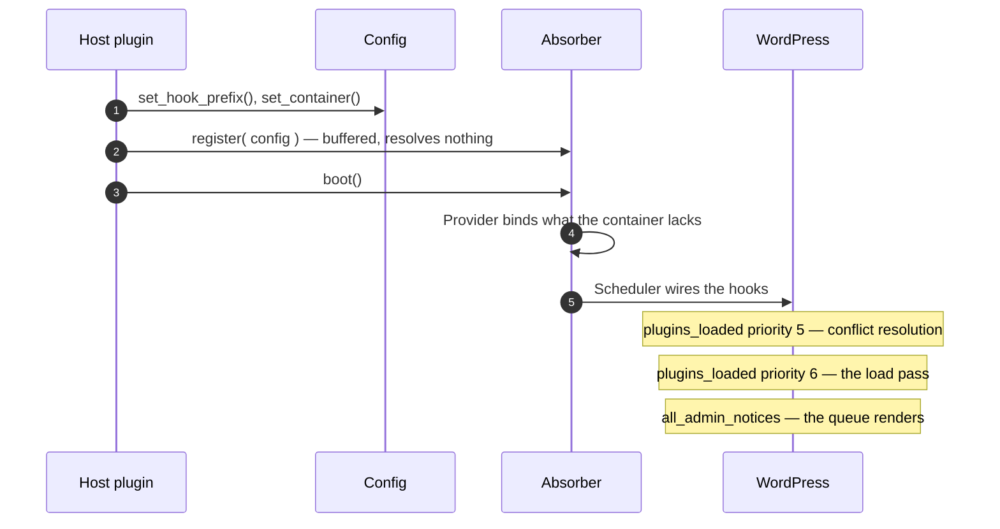
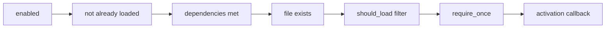
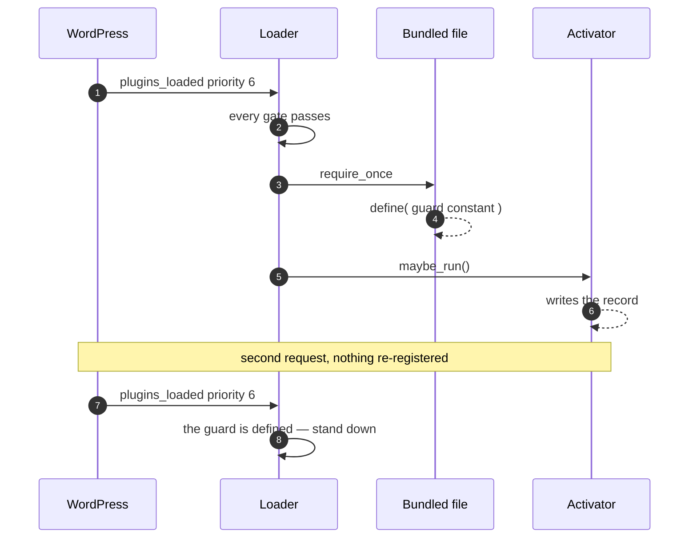
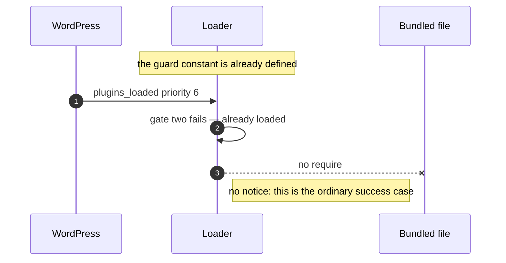
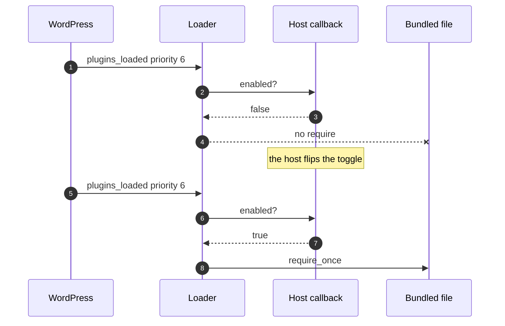
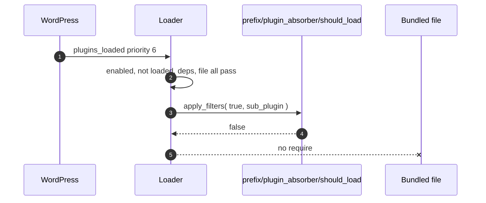
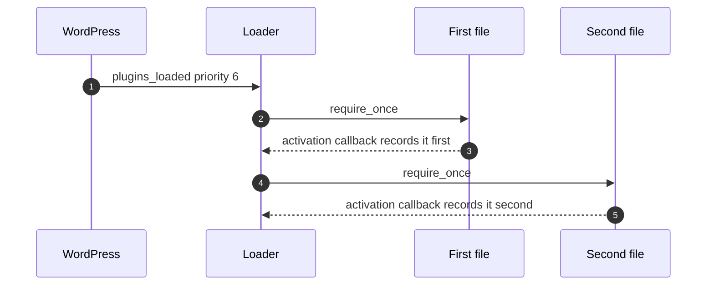
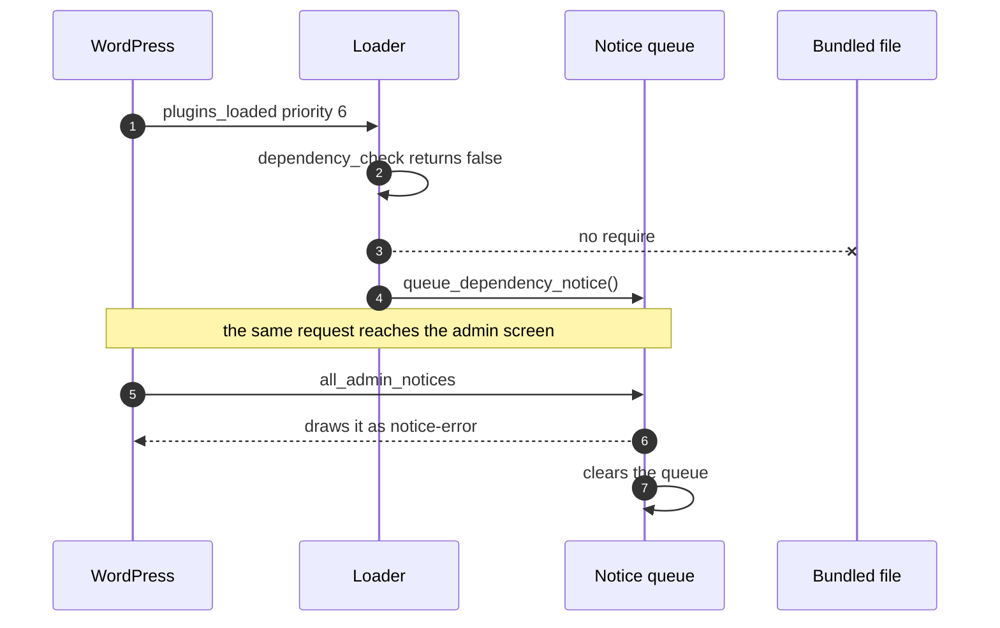

# Tests

Codeception on top of a real WordPress, run through [slic](https://github.com/stellarwp/slic).

## Running

```bash
slic use plugin-absorber
slic composer install
slic cc build

slic run unit                     # singlesite
slic run unit --env multisite     # multisite
```

CI runs both envs on PHP 7.4 and 8.5 — the ends of the supported range — against WordPress
`latest` and `nightly`. Four legs, with the `nightly` ones non-blocking.

## The container

The container is required, so any test that reaches a collaborator has to set
one. `WithContainer` is the one-line form: it builds a `Test_Container`, runs
the library's own `Provider` over it, and hands it to `Config`.

```php
use Nexcess\PluginAbsorber\Tests\Support\Traits\WithContainer;

public function setUp(): void {
	parent::setUp();

	Absorber_State::reset();
	Config_State::reset();
	Config::set_hook_prefix( 'give' );
	$this->set_up_container();
}
```

A test about a *rebinding* host binds its own implementation first and passes
the container in — the provider only binds what nothing else has, which is the
guarantee those tests exist to pin:

```php
$container = new Test_Container();
$container->singleton( Writer_Interface::class, static fn() => $notices );

$this->set_up_container( $container );
```

Bind interfaces, not concrete classes: DI52 reports `has()` true for any class
name that exists, bound or not, so binding `Notices\Store` first cannot
demonstrate anything the provider does.

`$this->resolve( Some::class )` is the typed read back out, and
`$this->container()` the container itself. Call `tear_down_container()` from
tearDown, alongside `Config_State::reset()`.

Container tests must use `Tests\Support\Test_Container`.
`lucatume\DI52\Container` implements PSR-11's `ContainerInterface`, not
StellarWP's, so passing it to `Config::set_container()` is a `TypeError`.

## Sub-plugin fixtures

`WithSubPlugins` builds a well-formed `Sub_Plugin`, so a test states only the
key it is actually about:

```php
use Codeception\TestCase\WPTestCase;
use Nexcess\PluginAbsorber\Tests\Support\Traits\WithSubPlugins;

class SomeTest extends WPTestCase {
	use WithSubPlugins;

	public function test_something(): void {
		$sub_plugin = $this->make_sub_plugin( [ 'enabled' => false ] );
	}
}
```

The slug defaults to `give-recurring`, and the other two required keys are
derived from whichever slug is in play, so fixtures for two sub-plugins never
collide on a path or a guard constant:

```php
$this->make_sub_plugin( [ 'slug' => 'give-fee-recovery' ] );
// bundled_plugin_file:    /tmp/give-fee-recovery/give-fee-recovery.php
// plugin_loaded_constant: GIVE_FEE_RECOVERY_VERSION_FIXTURE
```

Never `define()` a constant ending in `_VERSION_FIXTURE`. `define()` lasts for
the whole PHP process, so a defined default would make `is_already_loaded()`
report true for every test that runs afterwards, in every class. A test that
needs the constant defined names its own:

```php
define( 'ABSORBER_TEST_LOADED_CONSTANT', '1.0.0' );

$this->make_sub_plugin( [ 'plugin_loaded_constant' => 'ABSORBER_TEST_LOADED_CONSTANT' ] );
```

Overrides are merged last, so a deliberately unusable value still reaches the
constructor — that is how the tests for rejected config work.

## Bundled plugin fixtures

`WithBundledPlugins` writes the file the load path requires:

```php
$constant = $this->make_guard_constant();
$path     = $this->make_bundled_plugin_file( $constant );

// … register, load …

$this->assertSame( 1, $this->bundled_plugin_loads() );
```

Every call writes a *new* file under a unique name, and every guard constant is
unique too. Neither is tidiness: `require_once` dedupes by resolved path for
the lifetime of the PHP process, so a shared fixture lets a later test pass
without loading anything, and the fixture defines its constant for real, so a
reused name makes a later sub-plugin read as already loaded. Call
`remove_bundled_plugin_files()` from tearDown.

A fixture helper cannot be called `make()`, `makeEmpty()`, `construct()`, or
`constructEmpty()`: those are public methods on `Codeception\Test\Unit`, which
`WPTestCase` extends, and redeclaring one with narrower visibility is a fatal at
class-compile time. The suite does not fail, it fails to start.

## Users and capabilities

Two of the library's gates turn on `activate_plugins`, so a test that reaches
either needs a user who has it. `WithUsers` owns both halves:

```php
$this->become_plugin_administrator();      // someone who may resolve a conflict
$this->create_user( 'subscriber' );        // someone who may not
```

`become_plugin_administrator()` is not just `create_user( 'administrator' )`. On
multisite `activate_plugins` maps through `manage_network_plugins`, which a site
administrator does not have — so it grants super admin there and sets the current
user either way. A test about *that* difference creates the administrator itself.

## Stubbing functions

Use `UopzFunctions` from wp-browser. Do not add a local `WithUopz` trait — this
library deliberately does not maintain one, so there is nothing to keep in sync
with the other plugin repos.

```php
use Codeception\TestCase\WPTestCase;
use lucatume\WPBrowser\Traits\UopzFunctions;

class SomeTest extends WPTestCase {
	use UopzFunctions;

	public function test_something(): void {
		$this->setFunctionReturn( 'is_plugin_active', true );
	}
}
```

Overrides are undone automatically after each test by the trait's `@after` hook,
so tests never need their own uopz cleanup. `setFunctionReturn()` calls
`markTestSkipped()` when the uopz extension is missing, so a machine without
uopz reports skips rather than confusing failures. Pass `true` as the third
argument to execute a closure in place of the function rather than returning it:

```php
$this->setFunctionReturn( 'wp_safe_redirect', static fn( $location ) => true, true );
```

### A stub closure has no class scope

uopz executes the replacement outside the test object, so neither `$this` nor
`self::` is available inside it. Both are fatal errors, not warnings:

```php
// Fatal: Using $this when not in object context.
// Fatal: Cannot access "self" when no class scope is active.
$this->setFunctionReturn(
	'deactivate_plugins',
	function ( $plugins ) {
		$this->deactivations[] = $plugins;

		throw new TestException( self::HALTED_AT_EXIT );
	},
	true
);
```

Arguments arrive normally, and `use` works — including by reference. So bind a
reference to the property first, resolve any class constant into a local, and
capture both. Writes through the reference land on the property, so the rest of
the test reads `$this->deactivations` as usual:

```php
$deactivations = &$this->deactivations;
$halt_message  = self::HALTED_AT_EXIT;

$this->setFunctionReturn(
	'deactivate_plugins',
	static function ( $plugins ) use ( &$deactivations, $halt_message ) {
		$deactivations[] = $plugins;

		throw new TestException( $halt_message );
	},
	true
);
```

Marking the closure `static` costs nothing and makes the constraint obvious to
the next reader, since `$this` was never usable in the first place.

## Never mock `exit()`

`UopzFunctions::preventExit()` exists, but do not use it. Neutralising `exit`
lets a test keep running past the point where production would have stopped, so
a test that should fail can report as passing and CI will not tell you.

Instead, stub the call immediately before `exit` and throw `TestException` from
it. Execution stops at a point the test controls, and the assertion is about
behaviour rather than about uopz.

Given code under test that ends a request:

```php
class Deactivator {
	public function redirect_back( string $destination ): void {
		wp_safe_redirect( $destination );

		exit;
	}
}
```

Assert it through `WithHaltedRedirects`, which owns the whole shape:

```php
use Nexcess\PluginAbsorber\Tests\Support\Traits\WithHaltedRedirects;

public function test_redirects_back(): void {
	$subject = new Deactivator();

	$location = $this->capture_redirect(
		static function () use ( $subject ): void {
			$subject->redirect_back( 'https://example.test/wp-admin/plugins.php' );
		}
	);

	$this->assertSame( 'https://example.test/wp-admin/plugins.php', $location );
}
```

Two parts of that are easy to drop by hand and silent when dropped, which is
why they live in the trait rather than in each test body. The `fail()` on the
line after the action is what turns "the code under test never redirected at
all" into a failure instead of a pass — the same class of failure this section
opens by warning about, moved out of `preventExit()` and into the test body.
Matching on the exception's message as well as its class keeps an unrelated
`TestException` thrown earlier from satisfying the catch for the wrong reason.

The trait needs `UopzFunctions` on the same class, for the stub.

`tests/unit/SmokeTest.php` covers both the mechanism and the trait, with
`test_a_stub_can_throw_to_halt_a_code_path` and
`test_the_shared_helper_captures_a_halted_redirect` — the executable proof that
a stub really can stop a code path before it reaches `exit`, and that the shared
helper reports it when one does not.

## Expecting `_doing_it_wrong()`

`setExpectedIncorrectUsage()` matches the first argument exactly, which for a
report made with `__METHOD__` means restating a private method name in the test.
That name is an implementation detail of where a gate happens to live — moving
the inline-boot fallback from `Absorber` to `Boot\Scheduler` changed it without
changing anything a host can observe.

`WithIncorrectUsage` registers the expectation from the report itself and
asserts over what was reported instead:

```php
$this->expect_incorrect_usage();

$loader->load_all();

$this->assert_the_library_reported_incorrect_usage();
```

An unexpected report still fails the test, because everything the listener sees
is recorded and asserted to belong to this library. Call
`stop_expecting_incorrect_usage()` from tearDown.

## The scenario suite

`tests/unit/Scenario/` drives the library the way a host plugin does, against
real WordPress state: the real `active_plugins` option, a real
`deactivate_plugins()` that really writes it, and real site options behind the
notice queue and the activation record. Nothing about the library is doubled,
except in the scenarios that are *about* a host binding its own collaborators.

Everything else in `tests/unit/` mirrors `src/` and tests one class with its
neighbours doubled. This folder is the exception, and it is named for what its
files describe rather than for a class: a **scenario** is one host bootstrap,
one or more requests, and assertions about what WordPress holds afterwards.

`Scenario/Bootstrap_Test_Case.php` is the abstract parent every scenario file
extends. It is not collected as a test — the runner takes `*Test.php`, and it is
deliberately not one.

### What a scenario may call

It reaches for no entry point a host does not have. The bootstrap is
`Config::set_hook_prefix()`, `Config::set_container()`, `Absorber::register()`
and `Absorber::boot()`, and everything after that arrives through the hooks
`boot()` wired:

| Helper | What it really does |
|---|---|
| `boot()` | `Config::set_container()` with a **bare** container, then `Absorber::boot()` |
| `run_request()` | `do_action( 'plugins_loaded' )`, and fails the test if it redirects |
| `run_halted_request()` | the same, for a request that must end in a redirect; returns where the user was sent |
| `render_admin_notices()` | `do_action( 'all_admin_notices' )`, and returns what was printed |
| `register()` | `Absorber::register()`, backed by a bundled fixture file that really exists |

The container is handed over bare rather than through `WithContainer`, because
`boot()` running the provider over it is one of the steps under test. Calling
the steps directly — `Loader::load_all()`, `Resolver::resolve_all()` — would
skip the half where the bugs are: an admin-only `add_action()` that never ran, a
step wired into a dispatch window that had already closed, a resolution ordered
behind the load pass.

Only two functions are stubbed: `wp_safe_redirect`, which throws so the request
halts where production calls `exit`, and `wp_get_referer`, which is a request
header no test can send. `preventExit()` is never used — it would let a request
carry on past the line production never returns from, which turns a failure into
a pass.

### Four preconditions

None of it means anything unless all four hold, and setUp establishes all four:

- **An interactive admin GET** — `set_current_screen( 'plugins' )` plus
  `set_request_method( 'GET' )`. `Conflict\Gatekeeper` turns away anything else,
  so without both of these every policy scenario would pass while resolving
  nothing at all.
- **A user who can `activate_plugins`** — `become_plugin_administrator()`. The
  gatekeeper checks the capability before anything is resolved, and the queue
  checks the same one before it renders, so as nobody the suite would be
  asserting that a no-op is a no-op.
- **The hook prefix** — both `plugins_loaded` steps report and return without
  one, and the queue and activation option names are derived from it.
- **A rewound `plugins_loaded` counter** — the harness dispatched the hook
  before any test ran, so `boot()` would rightly report that it is too late to
  wire and run everything inline.

The screen, the request method and that counter are all process-global, so all
three are restored in tearDown; leaving any of them set turns an unrelated later
test into an admin request.

Run both legs. Multisite is not a formality here: `deactivate_plugins()` is
network-aware, `activate_plugins` maps through `manage_network_plugins` so the
administrator who passes on singlesite is not the one who passes on multisite,
and the queue and the activation record are `get_site_option()` values, which
are network options there. Every precondition above resolves differently on the
second leg.

### The cases

Every scenario shares one shape, so it is drawn once here rather than six times
below. A host bootstraps, and from then on the library is only ever reached
through hooks:



#### `Scenario/LoadTest.php` — a bundled plugin nothing is fighting over

No standalone is in the way in any of these, so priority 5 finds nothing to do
and what is under test is the chain priority 6 walks, in the order it walks it:



Each gate skips to the next sub-plugin on the first failure, and the activation
callback runs only after a require that actually happened.

**A fresh load defines the guard and activates exactly once.** Nothing else
claims the plugin, and the host supplied an activation callback. The file is
required once, the guard constant is defined, the callback runs, and the
once-ever record is written — and a second request repeats none of it.



**The bundled copy stands down when the guard is already defined.** A must-use
copy, a second host bundling the same code, or the owner's own snippet has
already defined the constant. Nothing is required — and nothing is queued
either, because a plugin the admin can watch working has nothing to explain.



**A sub-plugin toggled off loads nothing.** The host's `enabled` callback
returns false, and then true. Nothing loads and nothing is said while it is off;
the load happens on the request after it is switched on, which is what proves
the toggle was the only thing stopping it — a missing file would have left the
same empty counter.



**The `should_load` filter can veto a load.** The host's last word before the
require, on the hook name its own prefix builds. No require, no guard constant,
and no notice — a host that vetoed the load does not need telling about it.



**Two sub-plugins load in one request, in registration order.** A host bundles
plugins that depend on one another, and the order it registers them in is the
only say it gets — not slug order, and not filesystem order. The order is read
back from each activation callback, which runs immediately after its own
require, so it is the order the files were really required in.



**An unmet dependency blocks the load and queues the explanation.** All the way
to the screen from the other end: `dependency_check` returns false, so nothing
loads, the host's own sentence is queued, and the next admin page draws it as an
error and consumes it — the owner is told once, not on every page load for ever.


