# Tests

Codeception on top of a real WordPress, run through [slic](https://github.com/stellarwp/slic).

## Running

```bash
slic use plugin-absorber
slic composer install
slic cc build

slic run unit                     # singlesite
slic run unit --env multisite     # multisite
```

CI runs both envs on PHP 7.4 and 8.5 — the ends of the supported range — against WordPress
`latest` and `nightly`. Four legs, with the `nightly` ones non-blocking.

## The container

The container is required, so any test that reaches a collaborator has to set
one. `WithContainer` is the one-line form: it builds a `Test_Container`, runs
the library's own `Provider` over it, and hands it to `Config`.

```php
use Nexcess\PluginAbsorber\Tests\Support\Traits\WithContainer;

public function setUp(): void {
	parent::setUp();

	Absorber_State::reset();
	Config_State::reset();
	Config::set_hook_prefix( 'give' );
	$this->set_up_container();
}
```

A test about a *rebinding* host binds its own implementation first and passes
the container in — the provider only binds what nothing else has, which is the
guarantee those tests exist to pin:

```php
$container = new Test_Container();
$container->singleton( Writer_Interface::class, static fn() => $notices );

$this->set_up_container( $container );
```

Bind interfaces, not concrete classes: DI52 reports `has()` true for any class
name that exists, bound or not, so binding `Notices\Store` first cannot
demonstrate anything the provider does.

`$this->resolve( Some::class )` is the typed read back out, and
`$this->container()` the container itself. Call `tear_down_container()` from
tearDown, alongside `Config_State::reset()`.

Container tests must use `Tests\Support\Test_Container`.
`lucatume\DI52\Container` implements PSR-11's `ContainerInterface`, not
StellarWP's, so passing it to `Config::set_container()` is a `TypeError`.

## Sub-plugin fixtures

`WithSubPlugins` builds a well-formed `Sub_Plugin`, so a test states only the
key it is actually about:

```php
use Codeception\TestCase\WPTestCase;
use Nexcess\PluginAbsorber\Tests\Support\Traits\WithSubPlugins;

class SomeTest extends WPTestCase {
	use WithSubPlugins;

	public function test_something(): void {
		$sub_plugin = $this->make_sub_plugin( [ 'enabled' => false ] );
	}
}
```

The slug defaults to `give-recurring`, and the other two required keys are
derived from whichever slug is in play, so fixtures for two sub-plugins never
collide on a path or a guard constant:

```php
$this->make_sub_plugin( [ 'slug' => 'give-fee-recovery' ] );
// bundled_plugin_file:    /tmp/give-fee-recovery/give-fee-recovery.php
// plugin_loaded_constant: GIVE_FEE_RECOVERY_VERSION_FIXTURE
```

Never `define()` a constant ending in `_VERSION_FIXTURE`. `define()` lasts for
the whole PHP process, so a defined default would make `is_already_loaded()`
report true for every test that runs afterwards, in every class. A test that
needs the constant defined names its own:

```php
define( 'ABSORBER_TEST_LOADED_CONSTANT', '1.0.0' );

$this->make_sub_plugin( [ 'plugin_loaded_constant' => 'ABSORBER_TEST_LOADED_CONSTANT' ] );
```

Overrides are merged last, so a deliberately unusable value still reaches the
constructor — that is how the tests for rejected config work.

## Bundled plugin fixtures

`WithBundledPlugins` writes the file the load path requires:

```php
$constant = $this->make_guard_constant();
$path     = $this->make_bundled_plugin_file( $constant );

// … register, load …

$this->assertSame( 1, $this->bundled_plugin_loads() );
```

Every call writes a *new* file under a unique name, and every guard constant is
unique too. Neither is tidiness: `require_once` dedupes by resolved path for
the lifetime of the PHP process, so a shared fixture lets a later test pass
without loading anything, and the fixture defines its constant for real, so a
reused name makes a later sub-plugin read as already loaded. Call
`remove_bundled_plugin_files()` from tearDown.

A fixture helper cannot be called `make()`, `makeEmpty()`, `construct()`, or
`constructEmpty()`: those are public methods on `Codeception\Test\Unit`, which
`WPTestCase` extends, and redeclaring one with narrower visibility is a fatal at
class-compile time. The suite does not fail, it fails to start.

## Plugin-function fixtures

`Plugin\Checker` and `Plugin\Deactivator` both guard the require of
`wp-admin/includes/plugin.php` on `deactivate_plugins()` existing, and neither
guard can be exercised by a test that has already required the real file —
which every test that stubs a plugin function has to, because uopz cannot stub a
function that does not exist yet, and a `require_once` cannot be undone for the
rest of the process. `WithPluginFunctions` builds the two states instead:

```php
$asked = $this->with_plugin_functions_missing(
	static function () use ( $checker ): void {
		$checker->is_active( 'give-recurring/give-recurring.php' );
	}
);

$this->assertSame( 'deactivate_plugins', $asked[0] ?? '' );
$this->assertSame( 1, $this->plugin_functions_loads() );
```

ABSPATH points at a throwaway root whose `wp-admin/includes/plugin.php` only
increments a counter, and `function_exists()` answers about `deactivate_plugins`
the way it does on a front-end request. Both are process-global, so the trait
restores them the moment the call returns rather than in tearDown.
`with_plugin_functions_present()` is the other state, and returns the root so a
test can include the fixture itself and show the counter really counts. Call
`forget_plugin_functions_loads()` from setUp and `tear_down_plugin_functions()`
from tearDown.

The guard's function name is spelled in the trait, not passed in: it has to stay
`deactivate_plugins()` rather than `is_plugin_active()`, which is a common
third-party shim, and the two callers must not be able to disagree about it.

## Users and capabilities

Two of the library's gates turn on the same capability — `manage_network_plugins`
on multisite and `activate_plugins` everywhere else — so a test that reaches
either needs a user who has it. `WithUsers` owns both halves:

```php
$this->become_plugin_administrator();      // someone who may resolve a conflict
$this->create_user( 'subscriber' );        // someone who may not
```

`become_plugin_administrator()` is not just `create_user( 'administrator' )`. Both
gates name `manage_network_plugins` on multisite, which a site administrator does
not have — so it grants super admin there and sets the current user either way. A
test about *that* difference creates the administrator itself.

## Stubbing functions

Use `UopzFunctions` from wp-browser. Do not add a local `WithUopz` trait — this
library deliberately does not maintain one, so there is nothing to keep in sync
with the other plugin repos.

```php
use Codeception\TestCase\WPTestCase;
use lucatume\WPBrowser\Traits\UopzFunctions;

class SomeTest extends WPTestCase {
	use UopzFunctions;

	public function test_something(): void {
		$this->setFunctionReturn( 'is_plugin_active', true );
	}
}
```

Overrides are undone automatically after each test by the trait's `@after` hook,
so tests never need their own uopz cleanup. `setFunctionReturn()` calls
`markTestSkipped()` when the uopz extension is missing, so a machine without
uopz reports skips rather than confusing failures. Pass `true` as the third
argument to execute a closure in place of the function rather than returning it:

```php
$this->setFunctionReturn( 'wp_safe_redirect', static fn( $location ) => true, true );
```

### A stub closure has no class scope

uopz executes the replacement outside the test object, so neither `$this` nor
`self::` is available inside it. Both are fatal errors, not warnings:

```php
// Fatal: Using $this when not in object context.
// Fatal: Cannot access "self" when no class scope is active.
$this->setFunctionReturn(
	'deactivate_plugins',
	function ( $plugins ) {
		$this->deactivations[] = $plugins;

		throw new TestException( self::HALTED_AT_EXIT );
	},
	true
);
```

Arguments arrive normally, and `use` works — including by reference. So bind a
reference to the property first, resolve any class constant into a local, and
capture both. Writes through the reference land on the property, so the rest of
the test reads `$this->deactivations` as usual:

```php
$deactivations = &$this->deactivations;
$halt_message  = self::HALTED_AT_EXIT;

$this->setFunctionReturn(
	'deactivate_plugins',
	static function ( $plugins ) use ( &$deactivations, $halt_message ) {
		$deactivations[] = $plugins;

		throw new TestException( $halt_message );
	},
	true
);
```

Marking the closure `static` costs nothing and makes the constraint obvious to
the next reader, since `$this` was never usable in the first place.

## Never mock `exit()`

`UopzFunctions::preventExit()` exists, but do not use it. Neutralising `exit`
lets a test keep running past the point where production would have stopped, so
a test that should fail can report as passing and CI will not tell you.

Instead, stub the call immediately before `exit` and throw `TestException` from
it. Execution stops at a point the test controls, and the assertion is about
behaviour rather than about uopz.

Given code under test that ends a request:

```php
class Deactivator {
	public function redirect_back( string $destination ): void {
		wp_safe_redirect( $destination );

		exit;
	}
}
```

Assert it through `WithHaltedRedirects`, which owns the whole shape:

```php
use Nexcess\PluginAbsorber\Tests\Support\Traits\WithHaltedRedirects;

public function test_redirects_back(): void {
	$subject = new Deactivator();

	$location = $this->capture_redirect(
		static function () use ( $subject ): void {
			$subject->redirect_back( 'https://example.test/wp-admin/plugins.php' );
		}
	);

	$this->assertSame( 'https://example.test/wp-admin/plugins.php', $location );
}
```

Two parts of that are easy to drop by hand and silent when dropped, which is
why they live in the trait rather than in each test body. The `fail()` on the
line after the action is what turns "the code under test never redirected at
all" into a failure instead of a pass — the same class of failure this section
opens by warning about, moved out of `preventExit()` and into the test body.
Matching on the exception's message as well as its class keeps an unrelated
`TestException` thrown earlier from satisfying the catch for the wrong reason.

The trait needs `UopzFunctions` on the same class, for the stub.

`tests/unit/SmokeTest.php` covers both the mechanism and the trait, with
`test_a_stub_can_throw_to_halt_a_code_path` and
`test_the_shared_helper_captures_a_halted_redirect` — the executable proof that
a stub really can stop a code path before it reaches `exit`, and that the shared
helper reports it when one does not.

## Expecting `_doing_it_wrong()`

`setExpectedIncorrectUsage()` matches the first argument exactly, which for a
report made with `__METHOD__` means restating a private method name in the test.
That name is an implementation detail of where a gate happens to live — moving
the inline-boot fallback from `Absorber` to `Boot\Scheduler` changed it without
changing anything a host can observe.

`WithIncorrectUsage` registers the expectation from the report itself and
asserts over what was reported instead:

```php
$this->expect_incorrect_usage();

$loader->load_all();

$this->assert_the_library_reported_incorrect_usage();
```

An unexpected report still fails the test, because everything the listener sees
is recorded and asserted to belong to this library. Call
`stop_expecting_incorrect_usage()` from tearDown.

## The scenario suite

`tests/unit/Scenario/` drives the library the way a host plugin does, against
real WordPress state: the real `active_plugins` option, a real
`deactivate_plugins()` that really writes it, and real site options behind the
notice queue and the activation record. Nothing about the library is doubled,
except in the scenarios that are *about* a host binding its own collaborators.

Everything else in `tests/unit/` mirrors `src/` and tests one class with its
neighbours doubled. This folder is the exception, and it is named for what its
files describe rather than for a class: a **scenario** is one host bootstrap,
one or more requests, and assertions about what WordPress holds afterwards.

`Scenario/Bootstrap_Test_Case.php` is the abstract parent every scenario file
extends. It is not collected as a test — the runner takes `*Test.php`, and it is
deliberately not one.

### What a scenario may call

It reaches for no entry point a host does not have. The bootstrap is
`Config::set_hook_prefix()`, `Config::set_container()`, `Absorber::register()`
and `Absorber::boot()`, and everything after that arrives through the hooks
`boot()` wired:

| Helper | What it really does |
|---|---|
| `boot()` | `Config::set_container()` with a **bare** container, then `Absorber::boot()` |
| `run_request()` | `do_action( 'plugins_loaded' )`, and fails the test if it redirects |
| `run_halted_request()` | the same, for a request that must end in a redirect; returns where the user was sent |
| `render_admin_notices()` | `do_action( 'all_admin_notices' )`, and returns what was printed |
| `register()` | `Absorber::register()`, backed by a bundled fixture file that really exists |
| `pin_headers_as_sent()` | says this scenario's output has already started, for every request it goes on to make |

The container is handed over bare rather than through `WithContainer`, because
`boot()` running the provider over it is one of the steps under test. Calling
the steps directly — `Loader::load_all()`, `Resolver::resolve_all()` — would
skip the half where the bugs are: an admin-only `add_action()` that never ran, a
step wired into a dispatch window that had already closed, a resolution ordered
behind the load pass.

Only two functions are stubbed: `wp_safe_redirect`, which throws so the request
halts where production calls `exit`, and `headers_sent`, which under CLI answers
for the test runner's output rather than for this request. `preventExit()` is
never used — it would let a request carry on past the line production never
returns from, which turns a failure into a pass.

`headers_sent` answers `false` unless a scenario says otherwise with
`pin_headers_as_sent()`. Both directions are load-bearing: left to the runtime,
`run_halted_request()` fails because the resolver takes the sent-headers branch,
and `run_request()` *passes* for the same reason — a request that cannot
redirect satisfies "this one must not redirect" without anything having been
tested. Saying so deliberately is what the late-boot conflict scenario is about,
because that is the one request production really does serve with its output
already started.

### Four preconditions

None of it means anything unless all four hold, and setUp establishes all four:

- **An interactive admin GET** — `set_current_screen( 'plugins' )` plus
  `set_request_method( 'GET' )`. `Conflict\Gatekeeper` turns away anything else,
  so without both of these every policy scenario would pass while resolving
  nothing at all.
- **A user who may manage plugins** — `become_plugin_administrator()`. The
  gatekeeper checks the capability before anything is resolved, and the queue
  checks the same one before it renders, so as nobody the suite would be
  asserting that a no-op is a no-op.
- **The hook prefix** — both `plugins_loaded` steps report and return without
  one, and the queue and activation option names are derived from it.
- **A rewound `plugins_loaded` counter** — the harness dispatched the hook
  before any test ran, so `boot()` would rightly report that it is too late to
  wire and run everything inline.

The screen, the request method and that counter are all process-global, so all
three are restored in tearDown; leaving any of them set turns an unrelated later
test into an admin request.

Two scenarios take the first precondition back off again, and that is the point
of them: `Conflict\Gatekeeper` is the only thing keeping this library off a
visitor's page view and out of the middle of an activation, so a suite where
every request satisfies the gate never watches it refuse one. They restate the
request rather than skipping setUp — a front-end screen and a URI naming none,
or the same admin GET with an `action` arg — so the only difference between them
and the scenario that deactivates is the one under test.

Run both legs. Multisite is not a formality here: `deactivate_plugins()` is
network-aware, `activate_plugins` maps through `manage_network_plugins` so the
administrator who passes on singlesite is not the one who passes on multisite,
and the queue and the activation record are `get_site_option()` values, which
are network options there. Every precondition above resolves differently on the
second leg.

### The cases

Every scenario shares one shape, so it is drawn once here rather than six times
below. A host bootstraps, and from then on the library is only ever reached
through hooks:

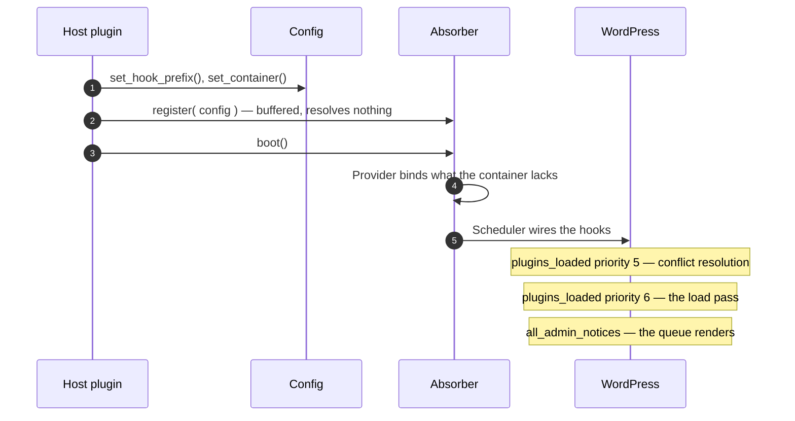

#### `Scenario/LoadTest.php` — a bundled plugin nothing is fighting over

No standalone is in the way in any of these, so priority 5 finds no conflict to
resolve — it still reads the registry, which is what the duplicate-slug scenario
below turns on — and what is under test is the chain priority 6 walks, in the
order it walks it:

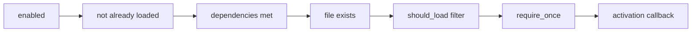

Each gate skips to the next sub-plugin on the first failure, and the activation
callback runs only after a require that actually happened.

**A fresh load defines the guard and activates exactly once.** Nothing else
claims the plugin, and the host supplied an activation callback. The file is
required once, the guard constant is defined, the callback runs, and the
once-ever record is written — and a second request repeats none of it.

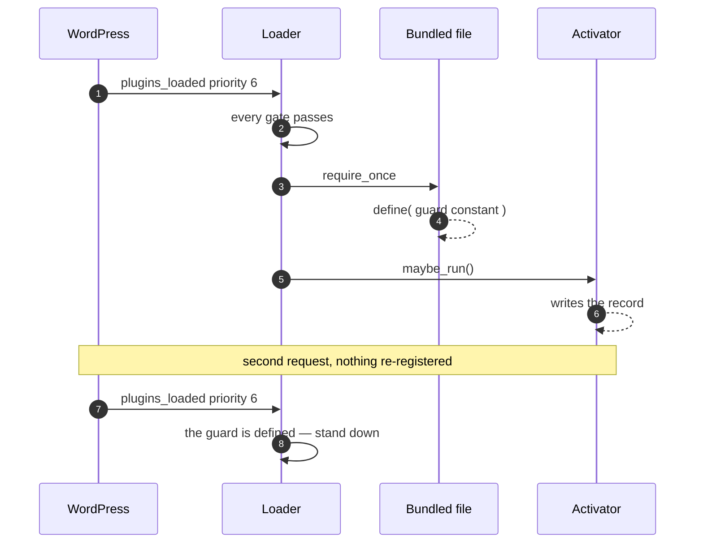

**The bundled copy stands down when the guard is already defined.** A must-use
copy, a second host bundling the same code, or the owner's own snippet has
already defined the constant. Nothing is required — and nothing is queued
either, because a plugin the admin can watch working has nothing to explain.

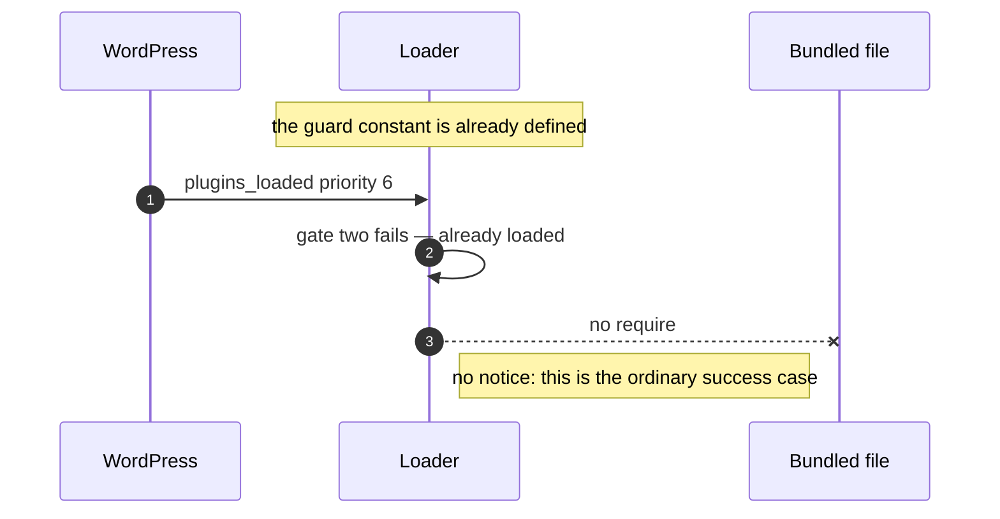

**A sub-plugin toggled off loads nothing.** The host's `enabled` callback
returns false, and then true. Nothing loads and nothing is said while it is off;
the load happens on the request after it is switched on, which is what proves
the toggle was the only thing stopping it — a missing file would have left the
same empty counter.

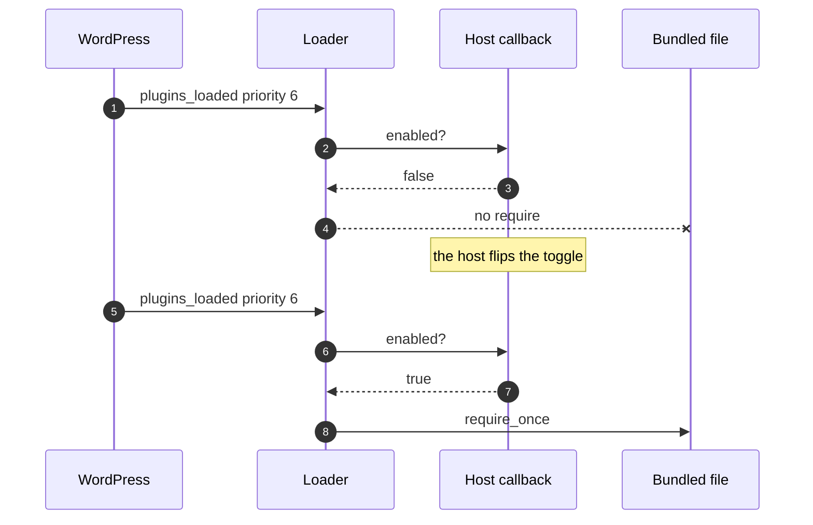

**The `should_load` filter can veto a load.** The host's last word before the
require, on the hook name its own prefix builds. No require, no guard constant,
and no notice — a host that vetoed the load does not need telling about it.

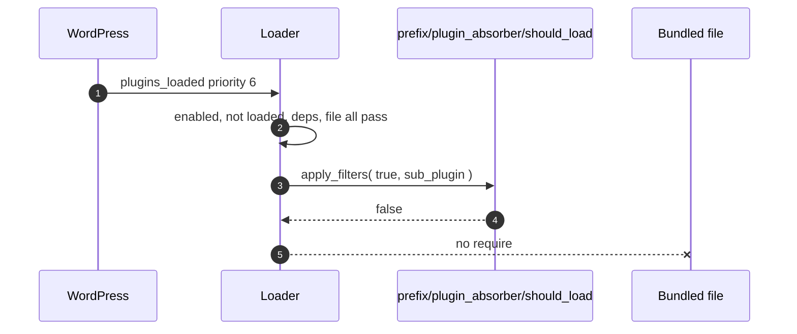

**Two sub-plugins load in one request, in registration order.** A host bundles
plugins that depend on one another, and the order it registers them in is the
only say it gets — not slug order, and not filesystem order. The order is read
back from each activation callback, which runs immediately after its own
require, so it is the order the files were really required in.

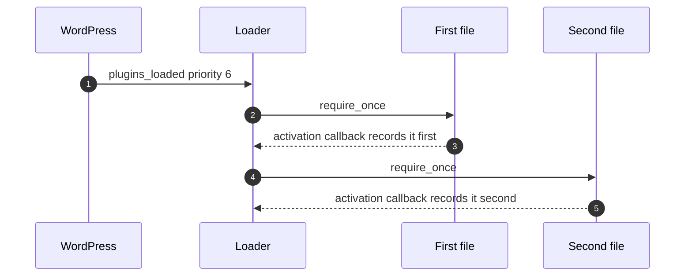

**An unmet dependency blocks the load and queues the explanation.** All the way
to the screen from the other end: `dependency_check` returns false, so nothing
loads, the host's own sentence is queued, and the next admin page draws it as an
error and consumes it — the owner is told once, not on every page load for ever.

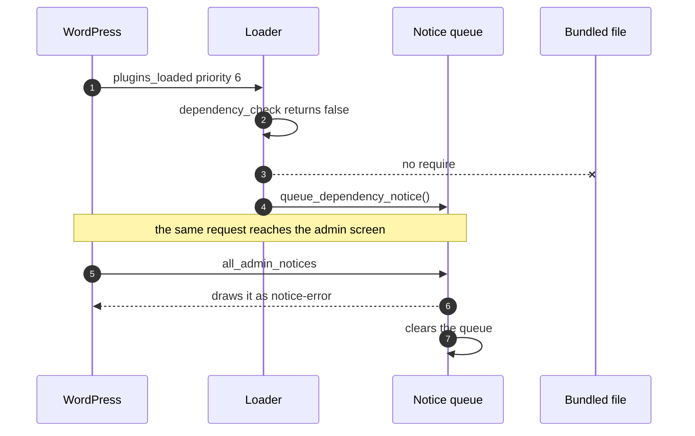

**A sub-plugin registered after boot still loads in the same request.** The shape
`Registry\Reader` drains at read time rather than at boot to support: a second
host module registers from its own `plugins_loaded` callback, added at the
priority the conflict pass already occupies and therefore running *behind* a
pass that has read the registry and emptied the buffer on its way past. A
registrar asked directly, or a buffer drained once at boot, would leave this
registration in a list nothing reads again.

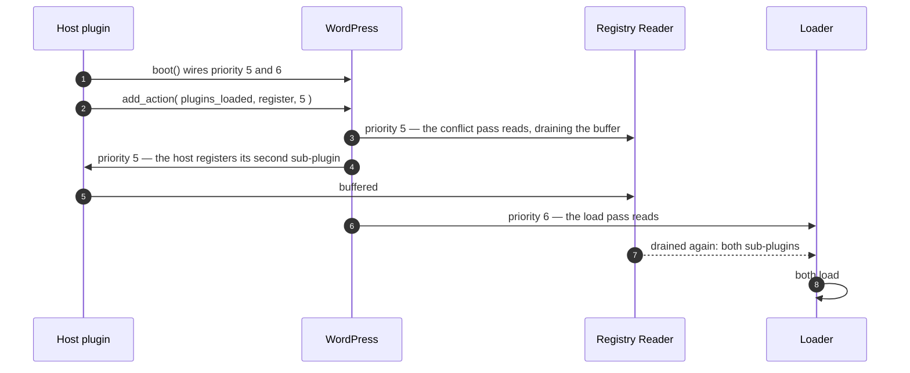

**A duplicate slug is reported, and what was registered behind it still loads.**
The collision is the registrar's exception and it is raised long after both
`Absorber::register()` calls returned, from inside `plugins_loaded` — the hook
this library exists to keep a site off the floor on. Both passes guard the read,
so the conflict pass reports it and the load pass, finding the buffer already
drained, gets on with the load. The whole batch is registered before the
collision is rethrown, which is what keeps a host from silently losing every
sub-plugin it registered after the mistake.

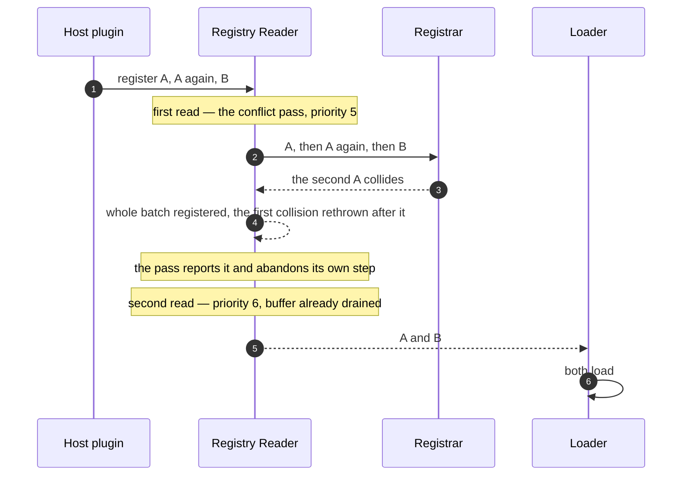

**A missing bundled file is the developer's problem, not the owner's.** Nobody
reading wp-admin can put a file back, so a broken build reports through
`_doing_it_wrong()` and the queue stays empty — including the sub-plugin's own
`dependency_notice_message`, which is the sentence a file gate folded into the
dependency gate would print and the wrong problem entirely. The sub-plugin
registered behind the broken one still loads.

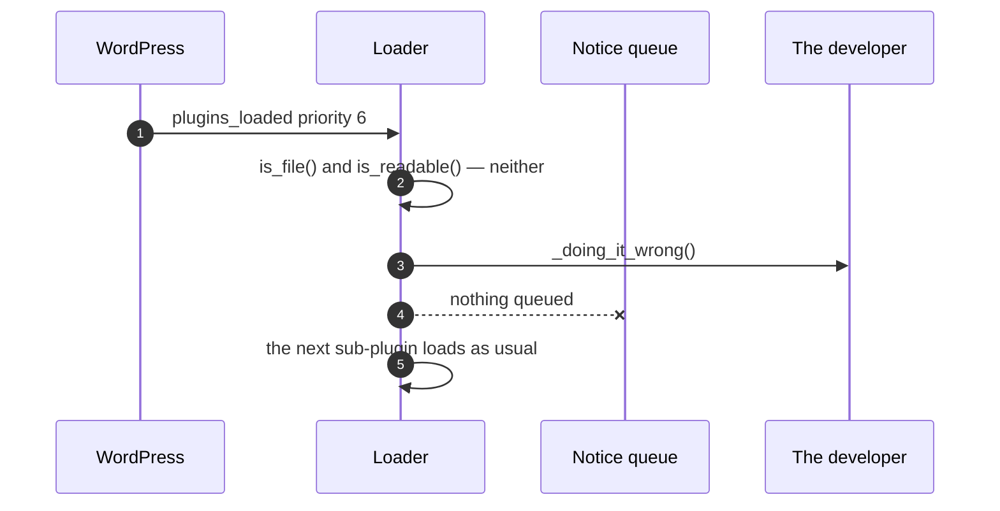

#### `Scenario/ConflictTest.php` — a standalone copy is still installed

Each of these puts a real basename into the real `active_plugins` option, so
core's own `deactivate_plugins()` is what turns it off and the real option is
what says whether it worked. Priority 5 is the step under test, and which branch
it takes is the sub-plugin's `conflict_policy`:

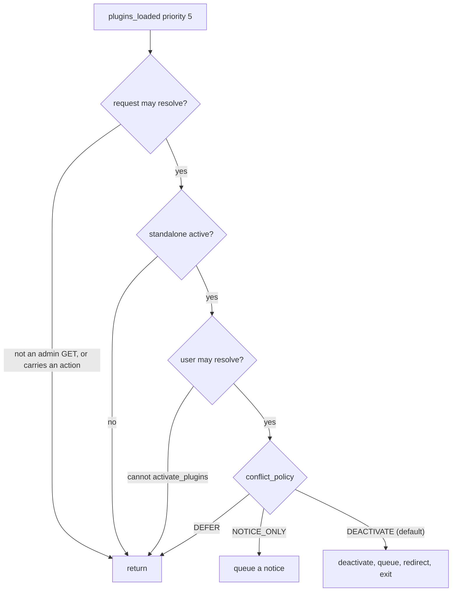

The gates are asked in that order on purpose: the detector reports and changes
nothing, so the cheap question goes in front of `current_user_can()`, which
resolves and caches the current user for the rest of the request.

**DEACTIVATE deactivates, notifies and redirects.** The default policy, against
core's own `deactivate_plugins()` rather than a stub of it. The standalone
leaves `active_plugins`, a merge notice is queued, and the user is sent back to
re-render what they asked for now that the standalone's code is out of memory.
The destination is asserted, not merely that a redirect happened.

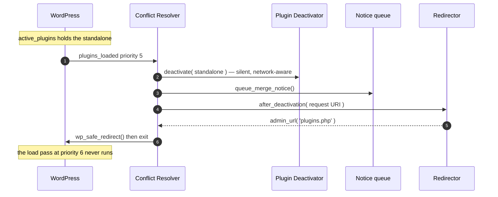

**The merge notice renders on the next admin screen, and clears.** All the way
to the screen. This notice is raised exactly once and never re-queued, so the
admin page load after the deactivation has to draw it — and consume it, or the
owner reads the same deactivation report for ever. It is a warning, not an
error: the library has already handled it.

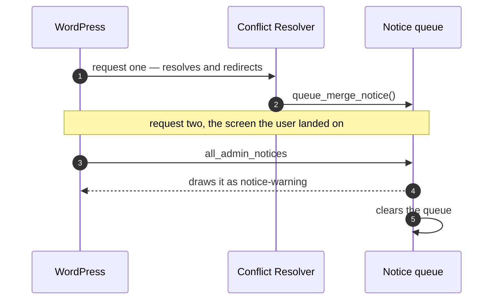

**The request after a deactivation does not loop.** The failure mode a merge
notice queued on every request would produce: a redirect loop, or a screen
reporting the same deactivation for ever. Nothing is re-registered between the
two requests — a duplicate slug throws — because this is the next page view, not
a second bootstrap. The second request must *not* halt, and the helper fails the
test if it does.

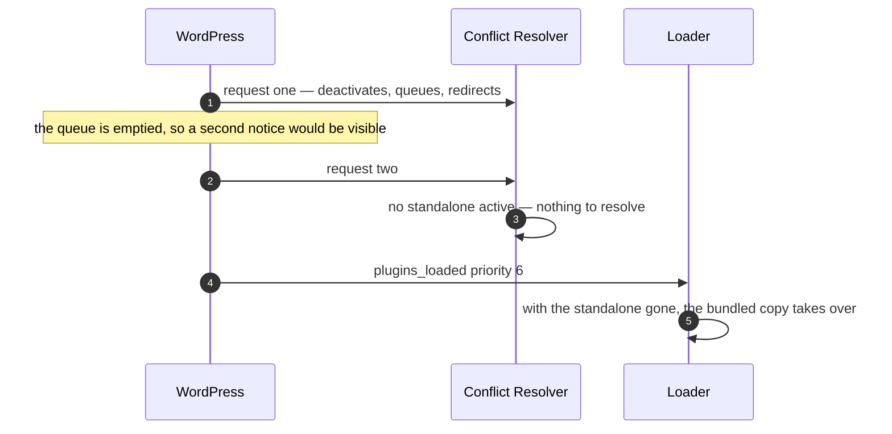

**DEFER leaves the standalone active and loads nothing.** The policy hands the
request to the standalone. WordPress includes an active plugin from
`wp-settings.php` long before `plugins_loaded`, so by the time the resolver runs
the standalone has already defined the guard constant — which is what stands the
bundled copy down. Defining it up front is what makes this the scenario the
policy describes, rather than a resolver that merely declined to act.

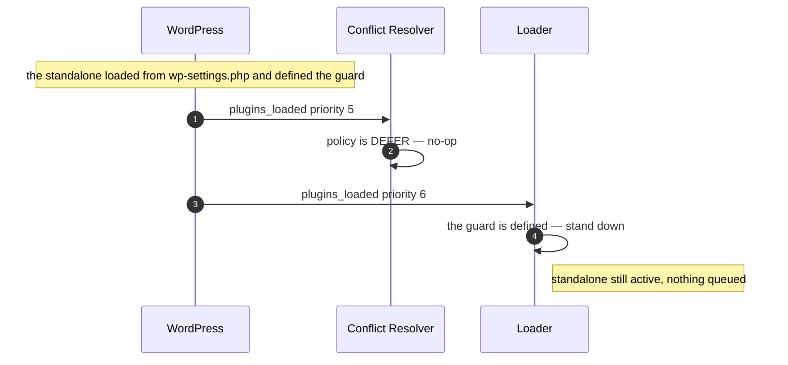

**NOTICE_ONLY notifies without deactivating.** A policy that only talks must not
end the request, which is what the non-halting helper asserts.

```mermaid
sequenceDiagram
    autonumber
    participant WP as WordPress
    participant R as Conflict Resolver
    participant Q as Notice queue

    WP->>R: plugins_loaded priority 5
    R->>Q: queue_conflict_notice() — the host's own sentence
    R-->>WP: returns; no deactivation, no redirect
    Note over WP: the standalone is still in active_plugins
```

**The conflict sits behind a sub-plugin that has none.** Every other multi-entry
scenario puts the conflicting sub-plugin first, where a detector that looked no
further than the head of the registry would still pass. Here the first has no
standalone at all and the second is the one in conflict, so the standalone is
deactivated, exactly one notice is queued and it is keyed to the second slug —
and the innocent sub-plugin's own bundled copy loads on the request after,
exactly as it would on a site with no standalone anywhere.

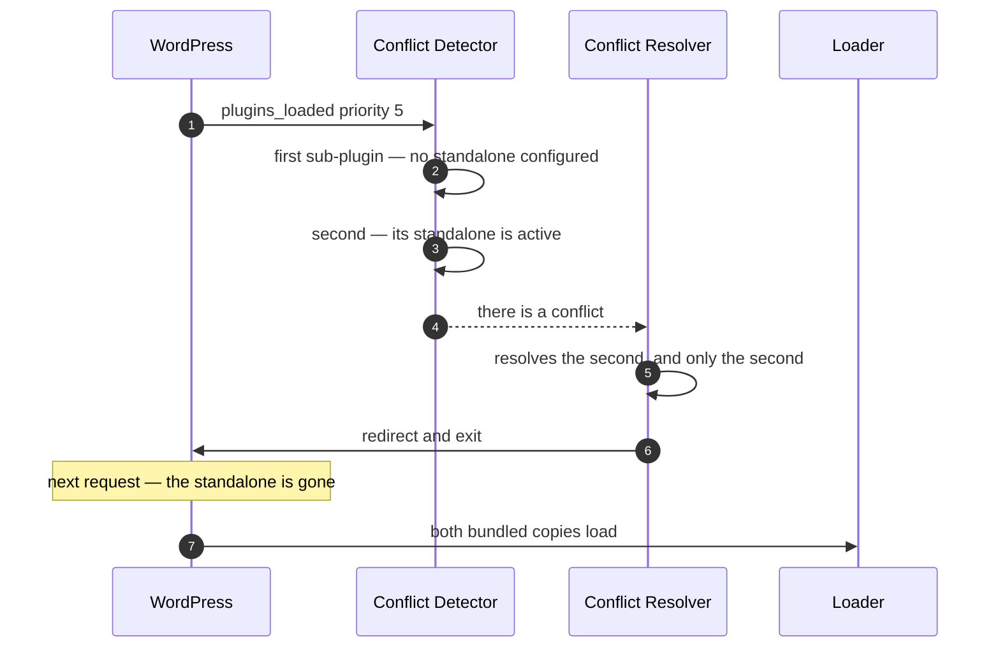

**A user who cannot activate plugins resolves nothing.** The gate that survives
every policy and every rebinding: whoever cannot activate a plugin must not be
able to deactivate one by loading an admin page. Nothing is consumed by
refusing — the standalone is still there to detect on the next request, from
someone who can act on it, which is what the second half asserts.

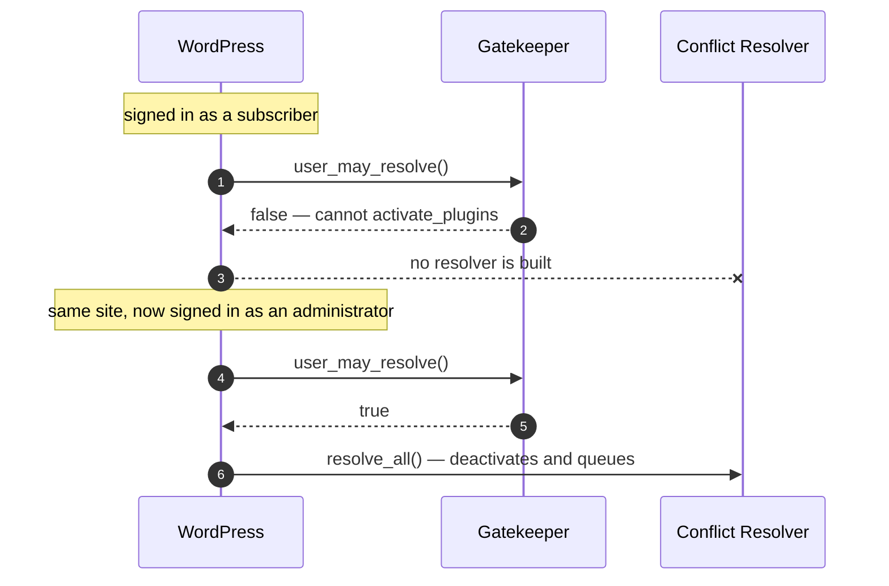

**A visitor's front-end request never deactivates or redirects.** The worst thing
this library could do to a site. `plugins_loaded` fires on every request one
serves, so the standalone is every bit as active on a checkout page view as it is
on the admin GET the first scenario resolves on — and resolving here would
deactivate a plugin and `exit` with a 302 on somebody who is not signed in and
cannot see wp-admin. The load pass behind it is asserted to have run, and that is
what makes the rest mean anything: it has no request gate of its own, so a
bootstrap that wired nothing at all would satisfy every other assertion.

**The activation request core replays is left alone.**
`plugins.php?action=activate` is what `plugin_sandbox_scrape()` replays while
WordPress activates a plugin, so resolving on it does not merely interrupt the
work: core reads a request that ended early as the plugin having fataled, and
tells the owner the plugin they just pressed Activate on is broken. The gate
refuses any action arg at all rather than a list of the dangerous ones, so this
one request stands for every screen in wp-admin that performs work on a GET.

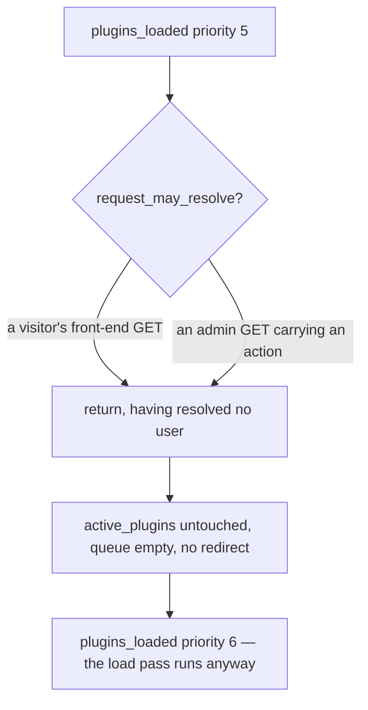

**A late boot with a conflict resolves inline, before the load.** The two halves
of the fallback meeting, and the redirect is the part that cannot survive it:
`Boot\Scheduler` opens the inline sequence with a `_doing_it_wrong()`, which
prints on a site with `display_errors` on, so by the time the conflict pass
reaches its redirect the headers are gone. `wp_safe_redirect()` would warn, set
no `Location` and leave the `exit` behind it to end the request on a blank page —
with the merge notice queued and nothing left to draw it. `Conflict\Resolver`
reads `headers_sent()` and stands the redirect down instead, which is what lets
the load pass run at all, one step behind on the same call stack. The order is
recorded from WordPress rather than from the library: the option write core's own
`deactivate_plugins()` makes, then the activation callback that runs immediately
after the require.

```mermaid
sequenceDiagram
    autonumber
    participant WP as WordPress
    participant Abs as Absorber
    participant R as Conflict Resolver
    participant L as Loader

    WP->>WP: plugins_loaded begins dispatching
    WP->>Abs: host calls boot() at priority 10 — too late to wire
    Abs->>R: step one, inline
    R->>R: deactivates, queues the merge notice
    R->>R: headers_sent() — the redirect stands down
    Abs->>L: step two, inline
    L->>L: the bundled copy loads on the same request
```

**A reactivation attempt yields the friendly message.** The one conflict the
load guard cannot prevent: the owner reinstalls the standalone and presses
Activate, WordPress includes it on top of the bundled copy, and the
re-declaration is a real fatal that core's sandbox reports as "the plugin
triggered a fatal error" — true, and useless. All the library gets to do is
reword the sentence. Driven through core's own filter dispatch rather than by
calling the rewriter, because the admin-only `add_filter()` is half of what has
to work. The notice box stays core's — its classes, its dismiss button, its
wrapper; only the sentence inside is ours.

```mermaid
sequenceDiagram
    autonumber
    participant Owner
    participant WP as WordPress
    participant Rw as Conflict Rewriter

    Owner->>WP: presses Activate on the standalone
    WP->>WP: sandbox includes it — re-declaration fatal
    WP->>WP: redirects to plugins.php with plugin and _error_nonce
    WP->>Rw: wp_admin_notice_markup filter
    Rw->>Rw: screen is plugins, arg names a registered standalone, nonce verifies
    Rw-->>WP: core's sentence swapped for the host's, wrapper untouched
```

#### `Scenario/HostTest.php` — the host's own wiring

Not what the library does with a sub-plugin, but what it does with the *host*:
that booting late still works, and that a host's own implementations are the
objects the request actually reaches.

**Where a host may bind, and when.** These scenarios are the worked example of a
rule that is easy to get wrong, so they show both halves side by side:

```mermaid
flowchart TD
    A[host builds a container] --> B{interface id or concrete class id?}
    B -- "interface, e.g. Resolver_Interface" --> C[bind BEFORE boot]
    B -- "class, e.g. Conflict Gatekeeper" --> D[bind AFTER boot]
    C --> E[Provider skips it: nothing can build an interface unprompted, so has is true only when bound]
    D --> F[Provider would overwrite it: di52 answers has true for any class that exists, bound or not]
    E --> G[the request reaches the host's object]
    F --> G
```

Binding a class after `boot()` still works because `Boot\Scheduler` wires
closures that resolve when the hook fires rather than objects built at boot — so
a host may rebind right up until `plugins_loaded`. `tests/unit/ProviderTest.php`
states the same rule from the provider's side.

**A host that boots too late still gets its sub-plugins.** Booting from
`plugins_loaded` at the default priority is the commonest hook mistake there is,
and an `add_action()` at a priority the running dispatch has already passed is
accepted and then never fires. The library reports the mistake through
`_doing_it_wrong()` and runs the sequence inline, so the site still gets its
bundled plugins.

```mermaid
sequenceDiagram
    autonumber
    participant WP as WordPress
    participant Abs as Absorber
    participant L as Loader

    WP->>WP: plugins_loaded begins dispatching
    WP->>Abs: host calls boot() at priority 10 — too late to wire 5 or 6
    Abs->>Abs: reports incorrect usage
    Abs->>L: runs the whole sequence inline, in hook order
    L-->>WP: the bundled plugin is loaded anyway
```

**A host binding reaches every step of the request.** Five interface seams bound
before boot — registrar, plugin checker, plugin deactivator, notice writer,
activator — each asserted to be the object the request used. The defaults are
asserted *not* to have run beside them: a library that quietly resolved a second
copy behind the host's back would satisfy every positive assertion here. Two
requests, because a DEACTIVATE resolution ends in a redirect and `exit`, so the
load pass belongs to the request after it.

```mermaid
sequenceDiagram
    autonumber
    participant Host as Host container
    participant WP as WordPress
    participant Spy as The host's objects
    participant Def as The library's defaults

    Host->>Host: binds 5 interface ids, then boot()
    WP->>Spy: request one — checker, deactivator, writer
    Spy-->>WP: redirect and exit
    WP->>Spy: request two — registrar, activator, the load
    Note over Def: active_plugins untouched, both options unwritten
    Def-->>Def: never resolved at all
```

**A host binding replaces the gatekeeper and the resolver.** The same guarantee
for the two the conflict step resolves itself. A host owns what a conflict
*means* — but not who may have one resolved, which is why the gate is asked
first, separately, and is asserted here to have been asked at all. Both gates
are counted, because they are asked at different moments and a single counter
would read "never got past the request gate" as "passed both".

```mermaid
sequenceDiagram
    autonumber
    participant Host as Host container
    participant G as The host's gatekeeper
    participant R as The host's resolver
    participant L as Loader

    Host->>Host: binds Resolver_Interface, then boot(), then Gatekeeper
    Host->>G: request_may_resolve()
    G-->>Host: true
    Host->>Host: a standalone is active — there is a conflict
    Host->>G: user_may_resolve()
    G-->>Host: true
    Host->>R: resolve_all() — this host's does nothing
    Note over R: so nothing is deactivated and nothing is queued
    Host->>L: the load pass still runs behind it
```
